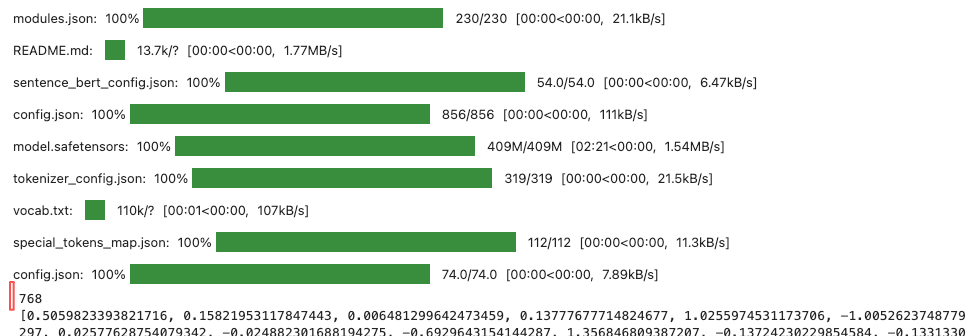
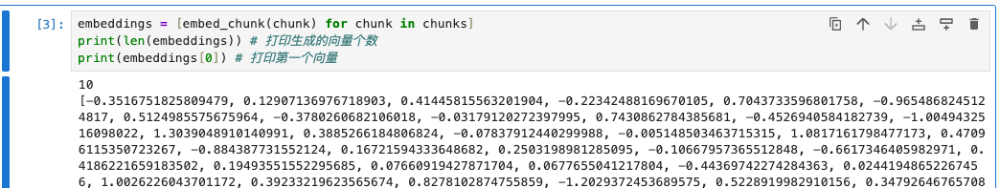
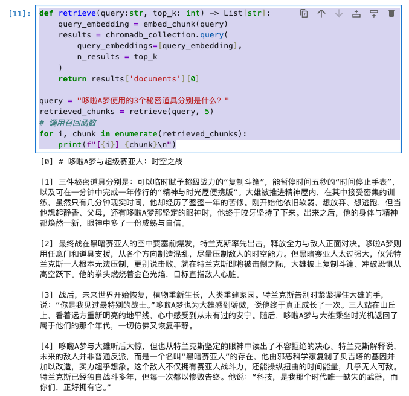
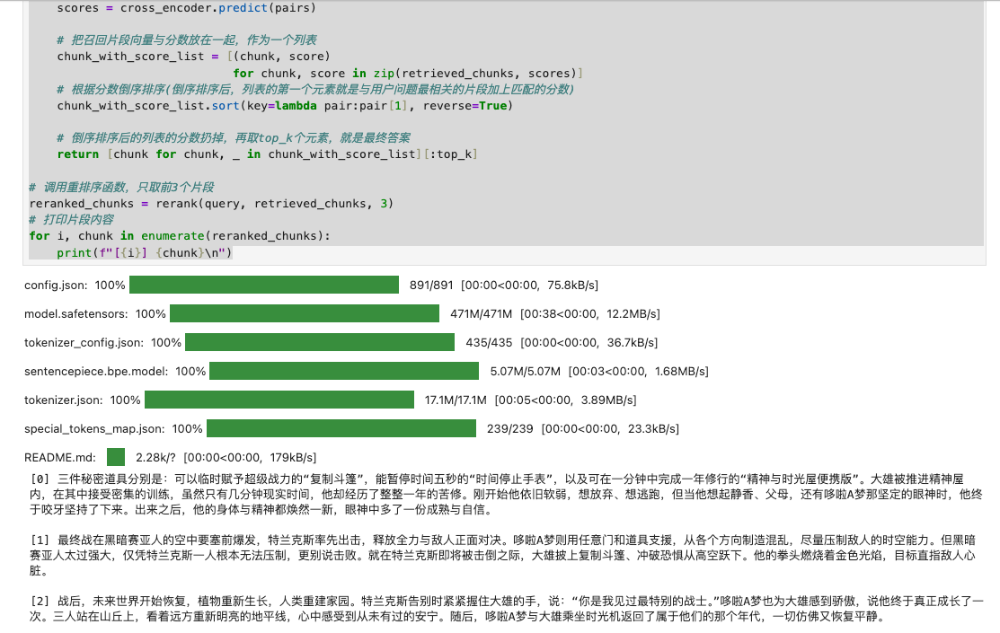

# 【README】

1. 准备环境：
   1. 安装UV：python包管理器； refer to [uv介绍及安装](https://blog.csdn.net/a772304419/article/details/147227924)
   2. 安装Jupyter Notebook：交互式代码执行环境，用于代码调试与验证；

# 【1】项目环境搭建

## 【1.1】构建项目目录及相关python依赖

步骤1： 构建项目目录；

```shell
uv init .
# 查看结果
(base) rong@RongdeMacBook-Pro rag_code % tree .
.
├── README.md
├── main.py
└── pyproject.toml
```

步骤2：删除main.py， 因为我们使用Jupyter Notebook执行文件。

```shell
(base) rong@RongdeMacBook-Pro rag_code % rm main.py
```

步骤3：使用uv安装依赖：

```
uv add sentence_transformers chromadb google-genai python-dotenv
```

补充：依赖说明：

- [ ] sentence_transformer ： 加载embedding 和 cross-encoder 模型；
- [ ] chromadb：向量数据库；
- [ ] Google-genai： google的ai sdk，调用gemini-2.5-flash 必备；
- [ ] Python-dotenv： 将Gemini api key 映射到环境变量中，以供google-genai读取；

步骤4：准备rag系统背后的文档。用户提问后，我们的rag系统就会在这个文档里面搜索答案。

为保证测试准确性，本文准备了一篇文章-《哆啦A梦与超级塞亚人：时空之战》

文章地址： [《哆啦A梦与超级塞亚人：时空之战》](https://github.com/MarkTechStation/VideoCode/blob/main/%E4%BD%BF%E7%94%A8Python%E6%9E%84%E5%BB%BARAG%E7%B3%BB%E7%BB%9F/rag/doc.md)


补充：等会，我们会把这篇文章喂给rag系统，让它基于这个文章回答问题； 

---

# 【2】构建rag简单系统

## 【2.1】分片-用户提问前

1. 使用uv启动 Jupyter Notebook 

```shell
(base) rong@RongdeMacBook-Pro rag_code % uv run --with jupyter jupyter lab
```

2. 编写文章分片代码：

```python
from typing import List

def split_into_chunks(doc_file:str) -> List[str]:
  with open(doc_file,'r') as file:
    content = file.read()
  return [chunk for chunk in content.split("\n\n")]

chunks = split_into_chunks("doc.md")

for i, chunk in enumerate(chunks):
  print(f"[{i}] {chunk}\n")
```


---

## 【2.2】索引-用户提问前

1. 索引：通过Embedding模型（嵌入模型）把每个片段文档转换为向量，然后把片段文本和向量一并存入向量数据库的过程；

步骤1：使用Embedding模型获取分片向量

```python
# 引入SentenceTransformer对象，并使用该对象加载一个Embedding模型
from sentence_transformers import SentenceTransformer

embedding_model = SentenceTransformer('shibing624/text2vec-base-chinese')

# 定义函数：用于获取某个给定片段对应的向量
def embed_chunk(chunk:str) -> List[float]:
  embedding = embedding_model.encode(chunk)
  return embedding.tolist()

# 测试案例1
test_embedding = embed_chunk("测试内容")
print(len(test_embedding)) # 打印向量维度
print(test_embedding) # 打印向量各维度值
```

【运行日志】



---

步骤2：循环调用embed_chunk函数，把文章《哆啦A梦与超级塞亚人：时空之战》分片后的多个片段文本转换为多个向量。

```python
embeddings = [embed_chunk(chunk) for chunk in chunks]
print(len(embeddings)) # 打印生成的向量个数 
print(embeddings[0]) # 打印第一个向量
```



<br>

步骤3：把向量保存到向量数据库中。

向量数据库：选择的是chromadb。

```python
import chromadb # 引入chromadb对象

# 创建访问向量数据库chromadb的客户端
chromadb_client = chromadb.EphemeralClient()
# 创建表格，collection是chromadb的概念，类似于数据库表
chromadb_collection = chromadb_client.get_or_create_collection(name="default")

# 定义保存向量到向量数据库的函数
def save_embeddings(chunks:List[str], embeddins: List[List[float]]) -> None:
  ids = [str(i) for i in range(len(chunks))]
  chromadb_collection.add(
    documents = chunks,
    embeddings = embeddins,
    ids = ids
  )
# 调用函数，把片段向量保存到向量数据库chromadb
save_embeddins(chunks, embeddings)

```

---

## 【2.3】召回-用户提问后 

```python
def retrieve(query:str, top_k: int) -> List[str]:
    query_embedding = embed_chunk(query) # embed_chunk索引函数：把query表示的问题转换为向量
    results = chromadb_collection.query(
        query_embeddings=[query_embedding],
        n_results = top_k
    )
    return results['documents'][0]

query = "哆啦A梦使用的3个秘密道具分别是什么？"
retrieved_chunks = retrieve(query, 5) # 调用召回函数：查询与用户问题最相似的5个片段
# 调用召回函数
for i, chunk in enumerate(retrieved_chunks):
    print(f"[{i}] {chunk}\n")
```

【运行日志】



【问题描述】

<font color=red>序号为1的片段是正确答案，但它没有被排在最上面，由此可见，向量数据库的相似度计算的准确度不高，虽然它把正确答案召回了</font>。

【解决方法】使用重排序解决上述问题。

---

## 【2.4】重排序

1. 重排阶段使用cross-encoder模型；

```python
from sentence_transformers import CrossEncoder

# query-用户问题，retrieved_chunks-召回的片段向量， top_k-重排后保留的片段数量
def rerank(query : str, retrieved_chunks: List[str], top_k : int) -> List[str]:
    # 创建cross_encoder模型对象
    cross_encoder = CrossEncoder('cross-encoder/mmarco-mMiniLMv2-L12-H384-v1')
    # 把用户问题与每个片段向量拼接为一个元组（不可变，封装多个值）
    pairs = [(query, chunk) for chunk in retrieved_chunks]
    # 调用cross_encoder计算问题与每个片段向量的相似度分数
    scores = cross_encoder.predict(pairs)

    # 把召回片段向量与分数放在一起，作为一个列表
    chunk_with_score_list = [(chunk, score) 
                             for chunk, score in zip(retrieved_chunks, scores)]
    # 根据分数倒序排序(倒序排序后，列表的第一个元素就是与用户问题最相关的片段加上匹配的分数)
    chunk_with_score_list.sort(key=lambda pair:pair[1], reverse=True)

    # 倒序排序后的列表的分数扔掉，再取top_k个元素，就是最终答案
    return [chunk for chunk, _ in chunk_with_score_list][:top_k]

# 调用重排序函数，只取前3个片段
reranked_chunks = rerank(query, retrieved_chunks, 3)
# 打印片段内容 
for i, chunk in enumerate(reranked_chunks):
    print(f"[{i}] {chunk}\n")
```

【打印结果】 



【说明】

- 重排前：三件秘密道具所在片段排在第2位；
- 重排后：三件秘密道具所在片段排在第1位；
- 由此可见，<font color=red>重排的效果确实要比召回好很多</font>；

---


