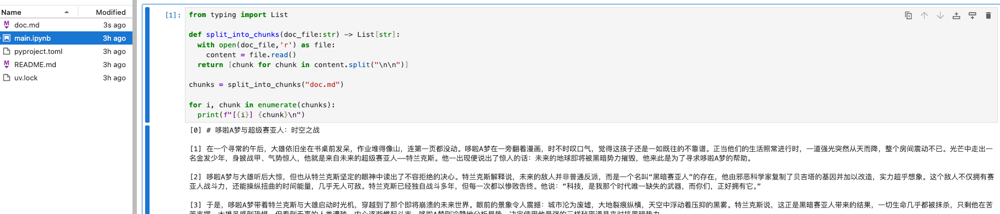

# 【README】

1. 准备环境：
   1. 安装UV：python包管理器； refer to [uv介绍及安装](https://blog.csdn.net/a772304419/article/details/147227924)
   2. 安装Jupyter Notebook：交互式代码执行环境，用于代码调试与验证；

# 【1】项目环境搭建

## 【1.1】构建项目目录及相关python依赖

步骤1： 构建项目目录；

```shell
uv init .
# 查看结果
(base) rong@RongdeMacBook-Pro rag_code % tree .
.
├── README.md
├── main.py
└── pyproject.toml
```

步骤2：删除main.py， 因为我们使用Jupyter Notebook执行文件。

```shell
(base) rong@RongdeMacBook-Pro rag_code % rm main.py
```

步骤3：使用uv安装依赖：

```
uv add sentence_transformers chromadb google-genai python-dotenv
```

补充：依赖说明：

- [ ] sentence_transformer ： 加载embedding 和 cross-encoder 模型；
- [ ] chromadb：向量数据库；
- [ ] Google-genai： google的ai sdk，调用gemini-2.5-flash 必备；
- [ ] Python-dotenv： 将Gemini api key 映射到环境变量中，以供google-genai读取；

步骤4：准备rag系统背后的文档。用户提问后，我们的rag系统就会在这个文档里面搜索答案。

为保证测试准确性，本文准备了一篇文章-《哆啦A梦与超级塞亚人：时空之战》

文章地址： [《哆啦A梦与超级塞亚人：时空之战》](https://github.com/MarkTechStation/VideoCode/blob/main/%E4%BD%BF%E7%94%A8Python%E6%9E%84%E5%BB%BARAG%E7%B3%BB%E7%BB%9F/rag/doc.md)


补充：等会，我们会把这篇文章喂给rag系统，让它基于这个文章回答问题； 

---

# 【2】构建rag简单系统

## 【2.1】分片

1. 使用uv启动 Jupyter Notebook 

```shell
(base) rong@RongdeMacBook-Pro rag_code % uv run --with jupyter jupyter lab
```

2. 编写文章分片代码：

```python
from typing import List

def split_into_chunks(doc_file:str) -> List[str]:
  with open(doc_file,'r') as file:
    content = file.read()
  return [chunk for chunk in content.split("\n\n")]

chunks = split_into_chunks("doc.md")

for i, chunk in enumerate(chunks):
  print(f"[{i}] {chunk}\n")
```



---

## 【2.2】索引


