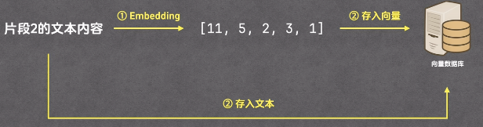
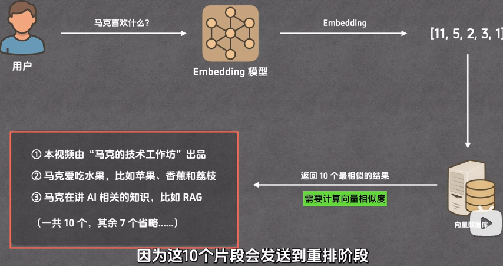
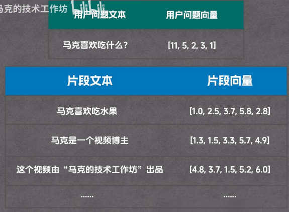
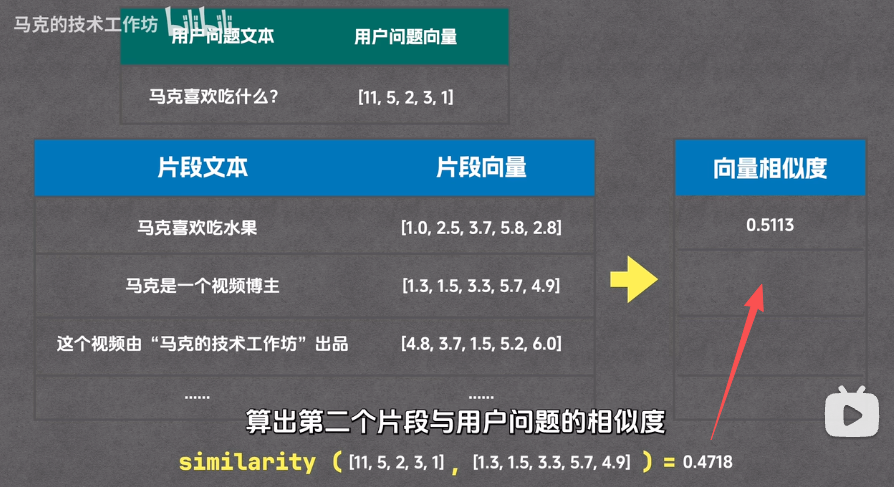

# 【README】

1. 总结自【RAG 工作机制详解——一个高质量知识库背后的技术全流程】，作者【马克的技术工作坊】

2. rag应用场景：
   1. 知识客服；
   2. 搭建能够回答问题的知识库；

---

# 【1】RAG介绍

1. rag定义： retrieval augmented generation, 检索增强生成；

2. rag主要干两件事情：
   1. 从资料库检索相关内容；【先检索】
   2. 就这些内容生成答案；【再生成】
3. rag是目前最常用的AI问答方案之一；如知识助手，智能客服；

---

## 【1.1】rag介绍目录

1. 总体介绍：
   1. 使用场景；
   2. rag基本流程；
2. 逐步拆解：
   1. 分片；
   2. 索引；
   3. 召回；
   4. 重排；
   5. 生成；
3. 全链路：
   1. 提问前链路；
   2. 提问后链路；

---

# 【2】rag底层实现细节

## 【2.1】问题描述

1. 背景：实现一个公司产品智能客服，这个客服可以回答各种产品问题，如产品的保修期是多长？ 
2. 问题：在给模型发送问题的时候，客户端把产品手册，连同问题一起一并发给大模型；但是若产品手册字段多，存在如下问题：
   1. 受token长度限制，模型无法读取所有内容；
   2. 模型推理成本高；（因为每次都解析一本手册）
   3. 模型推理慢；
3. 解决方案：把产品手册中与问题相关的内容发给大模型，这就需要rag来解决。

---

## 【2.2】rag的基本运行流程

1. rag的基本运行流程
   1. 步骤1：rag把文档切分为多个片段；
   2. 步骤2：当用户提出问题后，rag从多个片段挑选出相关的片段（如挑选出3个片段）； 
   3. 步骤3：把客户的问题描述以及产品手册相关片段一起，一并发给大模型；（这时模型就只会感知3个相关片段，而不是整个文档）

---

## 【3】rag运行流程详解

1. rag运行流程分为2个阶段：
   1. 准备（提问前）-2个环节： 分片，索引；
   2. 回答（提问后）-3个环节： 召回，重排， 生成；

## 【3.1】分片

1. 定义：把文档切分为多个片段；
2. 分片方式可以有多种：
   1. 按字数来分，如1000字一个片段；
   2. 按段落来分，如1个段落一个片段；
   3. 按章节来分
   4. 按页码分；

## 【3.2】索引

1. 定义：通过Embedding模型（嵌入模型）把每个片段文档转换为向量，然后把片段文本和向量一并存入向量数据库的过程；如下图所示。

2. 向量：
   1. 定义：一组数字表示的有大小有方向的量；
   2. 每个向量都有维度；

## 【3.3】召回

1. 定义：搜索与用户问题相关片段的过程；
2. 召回步骤：
   1. 步骤1：用户问题发给Embedding模型-嵌入模型；如马克喜欢什么？
   2. 步骤2：embedding模型会把用户问题转为向量；
   3. 步骤3：把用户问题文本与向量一并发给向量数据库；让向量数据库查询与用户问题最相关的10个片段；(这10个与用户问题相关的片段，作为召回结果)
      1. 补充：10并不是固定的，可以设置；

3. 向量数据库如何查找与用户问题最相关的片段呢？
   1. 通过向量相似度来计算；

---

### 【3.3.1】计算向量相似度过程

1. 用户问题向量与片段文本及片段向量

2. 向量相似度计算过程：

步骤1：计算用户问题向量与每一个片段向量的相似度；

 

步骤2：计算完成后，把用户问题向量与所有片段向量的向量相似度排序，得到与用户问题向量相似度最高的10个片段向量（可自定义）。

---

### 【3.3.2】similaity-向量相似性函数定义

1. 向量相似度算法：
   1. 余弦相似度；即两个向量之间的夹角的cos值；
   2. 欧氏距离；
   3. 向量点积；

---

## 【3.4】重排（重新排序）

1. 重排是对召回得到的10个与用户问题最相关的片段进行再次排序与选择； 
   1. 召回复习：是从产品手册的100个片段中挑选出与用户问题最相似的10个片段；（初筛）
   2. 重排：是从10个最相关片段中再次挑选3个与用户问题最相关的片段；（细筛）
2. 定义： 

