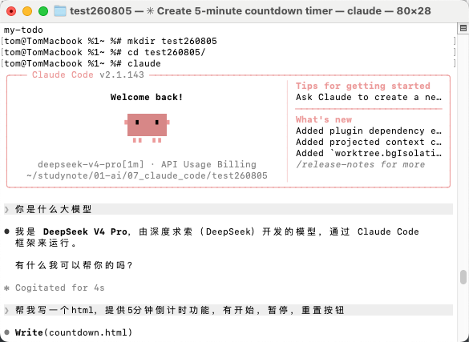
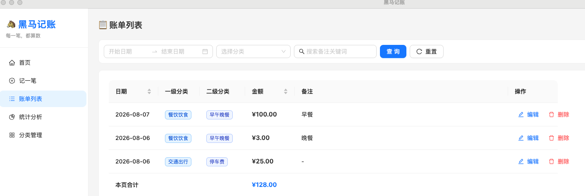
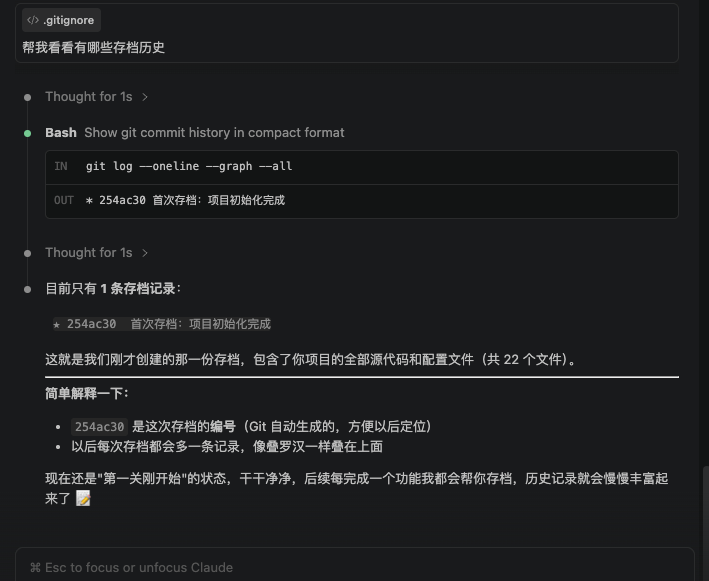
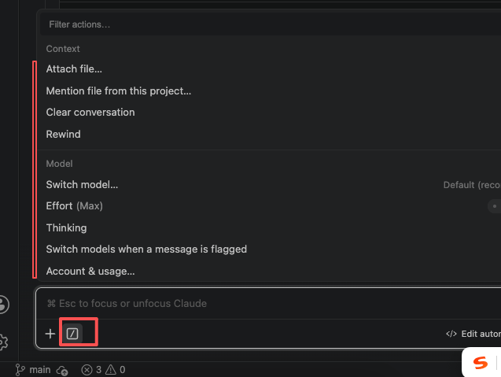
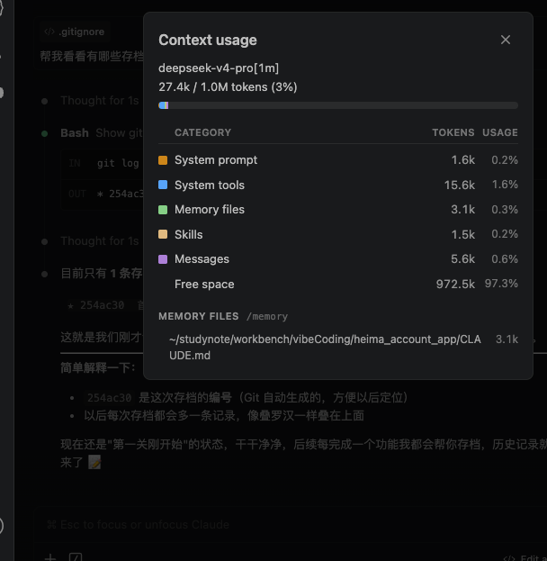
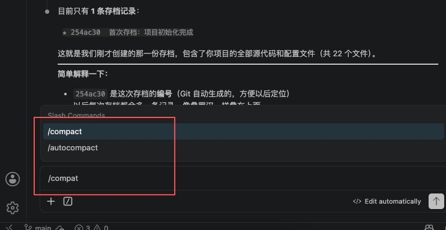
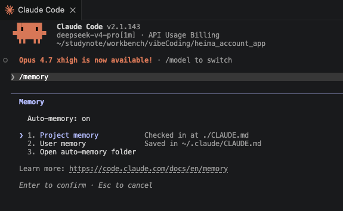
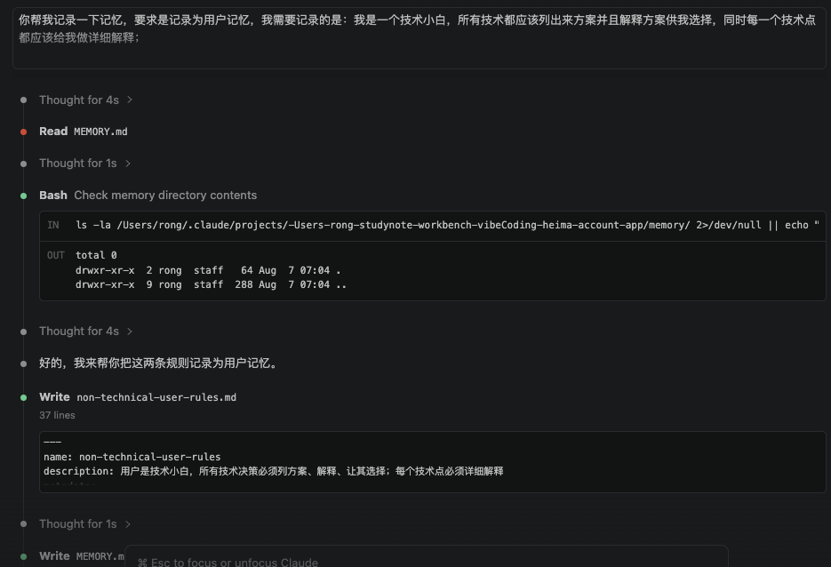
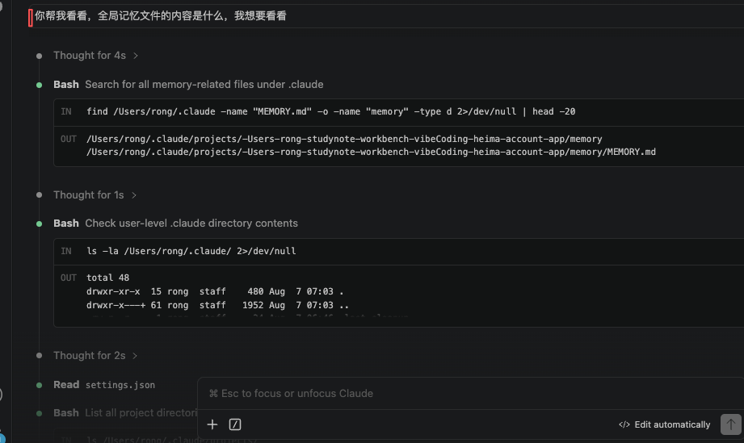
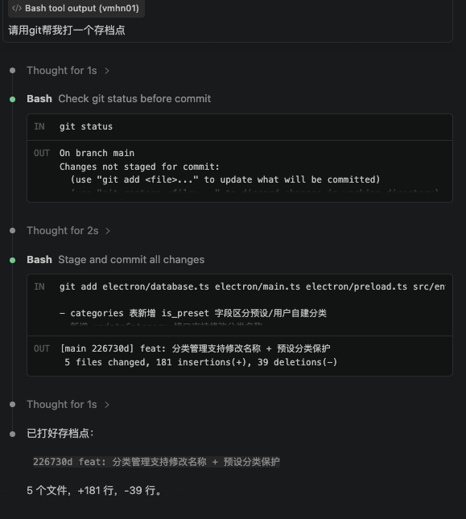

# 【README】

本文总结自B站【黑马Vibe Coding零基础入门】； 

课程参考资料：[黑马VibeCoding学习资料](https://www.yuque.com/xxcls/vibecoding)

---

# 【1】mac安装claude

 

```c++
# 如果网络环境不太好可以先执行这条命令
npm config set registry https://registry.npmmirror.com

# 执行如下命令，开始安装claude code
sudo npm install -g @anthropic-ai/claude-code
```

验证安装结果：

```shell
claude --version
```

打开~/.claude/settings.json 文件， 如果没有，自行touch创建； 

复制如下内容(本文参考 DeepSeek 官方文档：https://api-docs.deepseek.com/zh-cn/guides/coding_agents)：

```json
{
  "env": {
    "ANTHROPIC_BASE_URL": "https://api.deepseek.com/anthropic",
    "ANTHROPIC_AUTH_TOKEN": "你的 DeepSeek API Key",
    "ANTHROPIC_MODEL": "deepseek-v4-pro[1m]",
    "ANTHROPIC_DEFAULT_OPUS_MODEL": "deepseek-v4-pro[1m]",
    "ANTHROPIC_DEFAULT_SONNET_MODEL": "deepseek-v4-pro[1m]",
    "ANTHROPIC_DEFAULT_HAIKU_MODEL": "deepseek-v4-flash[1m]",
    "CLAUDE_CODE_DISABLE_NONESSENTIAL_TRAFFIC": "1",
    "CLAUDE_CODE_EFFORT_LEVEL": "max"
  }
}
```

操作步骤总结如下：

```c++
1. 打开终端软件（一定要是全新打开的）
2. 执行 mkdir .claude
3. 执行 cd .claude
4. 执行 touch settings.json
5. 执行 open settings.json
```

<br>

## 【1.1】测试claude

进入claude工作目录（自定义），如test260805，在工作目录执行 claude命令，进入claude工作台； 

步骤1：先问一个问题——你是什么大模型；



<br>

---

# 【7】入门案例-贪吃蛇GUI游戏开发

---

# 【8】VSCode安装claude插件

---

# 【9】黑马记账app

1. 使用claude生成 claude.md文件，提示词如下：

```
我需要生成一个App，名称叫做黑马记账，我不动编程技术，首次使用claude Code，你先帮我设计产品文档，并且记录到 claude.md文件中。

我的一些要求如下：
1. 我需要这个app可以运行在mac电脑上；
2. app功能主要记录用户的每一次花销（人民币），并且可以记录花销的分类，分类为2级，一级大类和二级小类，分类你来设计；
3. 技术栈选型你来决定，并列出来几个方案给我列出来优劣势，我来挑选并决定； 

注意：在整个项目开发职工，任何关于技术方面的事情，我是小白，我无法提供具体的要求 ，必须是你列出方案给我，并向我解释各个方案，由我来决定，请将这个要求详细记录在claude.md中，并在整个项目期内遵守
```

---

## 【9.1】开发与调试记录

第1遍，ai跑代码，访问失败；

第2遍，让claude自己优化，优化成功，可以访问；



<br>

---

# 【10】工程化控制-git初始化与上下文压缩

1. 提示词1：

```c++
我电脑安装有git，请帮我把这个项目加入git管理，避免丢失代码和功能；我不懂git，你要在执行的动作之前讲解你要做的方案是什么，并且询问我是否同意
```

2. 提示词2：

```c++
帮我看看有哪些存档历史
```



<br>

---

## 【10.1】使用claude命令

1. 查看claude命令：



<br>

---

### 【10.1.1】claude命令-context-上下文



【图片描述】

1. Deepseek-v4-pro[1m]： 表示支持1m=100万的tokens的上下文；
   1. 即，我们与deepseek聊的每一句话，这句话会附带最多100万token作为上下文，记录历史对话； 
2. messages：使用者与大模型对话的历史记录上下文； 
   1. <font color=red>为了减少上下文，我们可以对messages进行压缩</font>；
3. <font color=red>压缩定义</font>：把关键信息保留下来； 
   1. 如何执行压缩： 执行claude命令-compact；   



<br>

---

# 【11】工程化控制-memory记忆管理

## 【11.1】会话

1. 每一个会话： 就是一个独立的上下文； 

## 【11.2】memory记忆管理

1. 管理记忆： 执行 /memory 命令



2. 让claude帮我们记录一下上下文；

【提示词】

```c++
你帮我记录一下记忆，要求是记录为用户记忆，我需要记录的是：我是一个技术小白，所有技术都应该列出来方案并且解释方案供我选择，同时每一个技术点都应该给我做详细解释；

将这2个规则，记录到用户记忆中，我要任何工程都生效。
```



<br>

---

【提示词】

```c++
find /Users/rong/.claude -name "MEMORY.md" -o -name "memory" -type d 2>/dev/null | head -20
--
/Users/rong/.claude/projects/-Users-rong-studynote-workbench-vibeCoding-heima-account-app/memory
/Users/rong/.claude/projects/-Users-rong-studynote-workbench-vibeCoding-heima-account-app/memory/MEMORY.md
```



<br>

---

# 【12】工程化控制-添加新功能及git再提交

提示词1：

```c++
当前项目中，记账的分类是如何控制的？存在哪里？支持用户修改吗？
```

提示词2：

```c++
请添加功能，实现用户可以在APP中手动添加新的分类，修改分类名称；要注意，用户无权限修改预设的分类，可以增删改自己的分类
```

提示词3：

```c++
请用git帮我打一个存档点
```



<br>

---

## 【12.1】claude命令

/context : 查看上下文token数量； 

/compact: 压缩上下文； 

<br>

---

# 【13】rewind命令回退代码


