# 【README】

本文总结自B站【黑马Vibe Coding零基础入门】； 

课程参考资料：[黑马VibeCoding学习资料](https://www.yuque.com/xxcls/vibecoding)

---

# 【1】mac安装claude

 

```c++
# 如果网络环境不太好可以先执行这条命令
npm config set registry https://registry.npmmirror.com

# 执行如下命令，开始安装claude code
sudo npm install -g @anthropic-ai/claude-code
```

验证安装结果：

```shell
claude --version
```

打开~/.claude/settings.json 文件， 如果没有，自行touch创建； 

复制如下内容(本文参考 DeepSeek 官方文档：https://api-docs.deepseek.com/zh-cn/guides/coding_agents)：

```json
{
  "env": {
    "ANTHROPIC_BASE_URL": "https://api.deepseek.com/anthropic",
    "ANTHROPIC_AUTH_TOKEN": "你的 DeepSeek API Key",
    "ANTHROPIC_MODEL": "deepseek-v4-pro[1m]",
    "ANTHROPIC_DEFAULT_OPUS_MODEL": "deepseek-v4-pro[1m]",
    "ANTHROPIC_DEFAULT_SONNET_MODEL": "deepseek-v4-pro[1m]",
    "ANTHROPIC_DEFAULT_HAIKU_MODEL": "deepseek-v4-flash[1m]",
    "CLAUDE_CODE_DISABLE_NONESSENTIAL_TRAFFIC": "1",
    "CLAUDE_CODE_EFFORT_LEVEL": "max"
  }
}
```

操作步骤总结如下：

```c++
1. 打开终端软件（一定要是全新打开的）
2. 执行 mkdir .claude
3. 执行 cd .claude
4. 执行 touch settings.json
5. 执行 open settings.json
```

<br>

## 【1.1】测试claude

进入claude工作目录（自定义），如test260805，在工作目录执行 claude命令，进入claude工作台； 

步骤1：先问一个问题——你是什么大模型；


<br>

---

# 【7】入门案例-贪吃蛇GUI游戏开发

---

# 【8】VSCode安装claude插件

---

# 【9】黑马记账app

1. 使用claude生成 claude.md文件，提示词如下：

```
我需要生成一个App，名称叫做黑马记账，我不动编程技术，首次使用claude Code，你先帮我设计产品文档，并且记录到 claude.md文件中。

我的一些要求如下：
1. 我需要这个app可以运行在mac电脑上；
2. app功能主要记录用户的每一次花销（人民币），并且可以记录花销的分类，分类为2级，一级大类和二级小类，分类你来设计；
3. 技术栈选型你来决定，并列出来几个方案给我列出来优劣势，我来挑选并决定； 

注意：在整个项目开发职工，任何关于技术方面的事情，我是小白，我无法提供具体的要求 ，必须是你列出方案给我，并向我解释各个方案，由我来决定，请将这个要求详细记录在claude.md中，并在整个项目期内遵守
```

---

## 【9.1】开发与调试记录

第1遍，ai跑代码，访问失败；

第2遍，让claude自己优化，优化成功，可以访问；


<br>

---

# 【10】工程化控制-git初始化与上下文压缩

1. 提示词1：

```c++
我电脑安装有git，请帮我把这个项目加入git管理，避免丢失代码和功能；我不懂git，你要在执行的动作之前讲解你要做的方案是什么，并且询问我是否同意
```

2. 提示词2：

```c++
帮我看看有哪些存档历史
```


<br>

---

## 【10.1】使用claude命令

1. 查看claude命令：


<br>

---

### 【10.1.1】claude命令-context-上下文


【图片描述】

1. Deepseek-v4-pro[1m]： 表示支持1m=100万的tokens的上下文；
   1. 即，我们与deepseek聊的每一句话，这句话会附带最多100万token作为上下文，记录历史对话； 
2. messages：使用者与大模型对话的历史记录上下文； 
   1. <font color=red>为了减少上下文，我们可以对messages进行压缩</font>；
3. <font color=red>压缩定义</font>：把关键信息保留下来； 
   1. 如何执行压缩： 执行claude命令-compact；   


<br>

---

# 【11】工程化控制-memory记忆管理

## 【11.1】会话

1. 每一个会话： 就是一个独立的上下文； 

## 【11.2】memory记忆管理

1. 管理记忆： 执行 /memory 命令


2. 让claude帮我们记录一下上下文；

【提示词】

```c++
你帮我记录一下记忆，要求是记录为用户记忆，我需要记录的是：我是一个技术小白，所有技术都应该列出来方案并且解释方案供我选择，同时每一个技术点都应该给我做详细解释；

将这2个规则，记录到用户记忆中，我要任何工程都生效。
```


<br>

---

【提示词】

```c++
find /Users/rong/.claude -name "MEMORY.md" -o -name "memory" -type d 2>/dev/null | head -20
--
/Users/rong/.claude/projects/-Users-rong-studynote-workbench-vibeCoding-heima-account-app/memory
/Users/rong/.claude/projects/-Users-rong-studynote-workbench-vibeCoding-heima-account-app/memory/MEMORY.md
```


<br>

---

# 【12】工程化控制-添加新功能及git再提交

提示词1：

```c++
当前项目中，记账的分类是如何控制的？存在哪里？支持用户修改吗？
```

提示词2：

```c++
请添加功能，实现用户可以在APP中手动添加新的分类，修改分类名称；要注意，用户无权限修改预设的分类，可以增删改自己的分类
```

提示词3：

```c++
请用git帮我打一个存档点
```


<br>

---

## 【12.1】claude命令

/context : 查看上下文token数量； 

/compact: 压缩上下文； 

<br>

---

# 【13】rewind命令回退代码

提示词1：

```c++
请帮我将APP的名字修改为记账APP
```

## 【13.1】claude命令

1. 在终端打开claude，执行/diff 命令，查看claude修改的代码

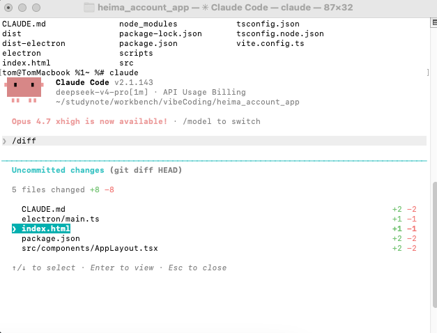

2. 双击esc键，打开rewind弹出框(代码回退)；【rewind：倒带/回退】

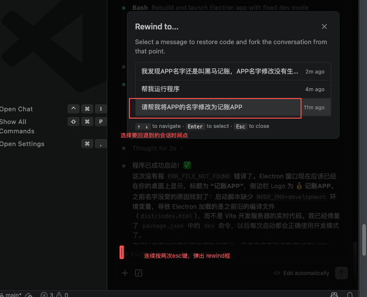

并选择continue，回退代码；

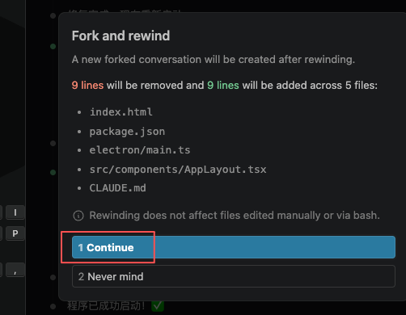

<br>

---

# 【14】工程化控制-把代码推送到git远端仓库

## 【14.1】推送本地代码到远程仓库

提示词1：

```c++
我即将将当前代码仓库推送到远程gitee上，但我需要得到公私钥，其中公钥要存放在gitee上，你帮我看看我的电脑是否有可用的公私钥？有的话，直接给我显示，没有的话，帮我创建好，然后直接显示公钥；
```

把公钥添加到github或gitee的公钥；

<br>

提示词2：

```
简易的命令行入门教程:
Git 全局设置:

git config --global user.name "tom-journey"
git config --global user.email "searonelove@sina.com"
创建 git 仓库:

mkdir xiaoma-account
cd xiaoma-account
git init 
touch README.md
git add README.md
git commit -m "first commit"
git remote add origin https://gitee.com/pacosonswjtu/xiaoma-account.git
git push -u origin "master"
已有仓库?

cd existing_git_repo
git remote add origin https://gitee.com/pacosonswjtu/xiaoma-account.git
git push -u origin "master"

我在gitee上创建了仓库，它给了一堆命令，我不懂，你帮我做。
```

【代码推送成功】

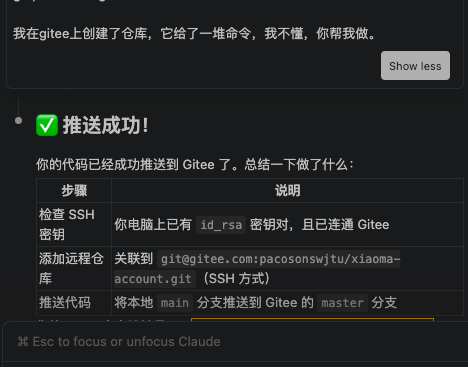

<br>

## 【14.2】本地新增readme.md文件并推送到远程repo

提示词1：

```c++
帮我编写一个README.md文件，写好后，本地添加存档点，并推送到gitee上。
```

提示词2：

```c++
帮我看看该项目有哪些存档点
```

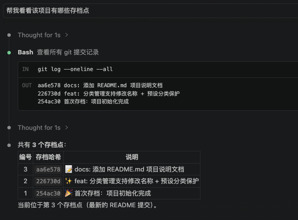

<br>

---

# 【15】工程化控制-创建代码分支和执行代码审查

提示词1：

```c++
我即将要给黑马记账APP添加一个贪吃蛇游戏，这个和主分支没有联系，请帮我创建一个新分支
```

提示词2：

```c++
分支创建好了吗？ 现在切换好分支了吗
```

提示词3：

```c++
帮我在程序中添加贪吃蛇游戏的功能，技术方案你来决定，列出方案给我选择
```

<br>

---

## 【15.1】claude命令-代码审查/code-review

执行/code-review命令执行代码检视 ； 

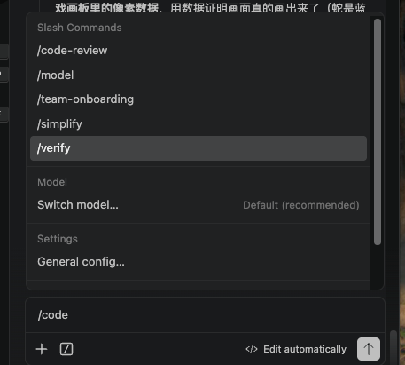

<br>

## 【15.2】提交代码，合并到main分支-主分支

提示词1：

```c++
帮我提交代码变更，并合并到主分支
```

提示词2：

```c++
推送提交记录到gitee上。
```

<br>

---

# 【16】工程化控制——自定义skill技能

## 【16.1】开发技能

提示词1：

```c++
我想要自定义技能，方便使用 / 调用它，如何做呢
```

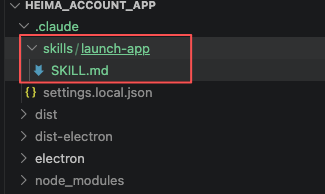

【SKILL.md】

```c++
---
name: launch-app
description: 启动黑马记账 App（开发模式）。当用户要求"启动应用/打开应用/运行 App/预览 App/测试 App/启动黑马记账"时使用。
---

# 目标

在开发模式下启动"黑马记账"桌面应用（Electron + Vite），让用户可以预览界面和测试功能。

# 执行步骤

1. **先检查是否已在运行**：检查端口 5173 是否被占用，或是否已有 electron / vite 进程在运行。如果已在运行，直接告诉用户"应用已经开着"，不要重复启动。
2. **后台启动**：在项目根目录运行 `npm run dev`，必须用后台方式运行（这是常驻进程，普通方式运行会一直卡住不返回）。
3. **等待就绪**：`npm run dev` 会先启动界面服务（约 1-2 秒），随后自动弹出 Electron 应用窗口。等待约 3-5 秒后确认：
   - 端口 5173 可以访问（界面服务已就绪）
   - Electron 进程存在（应用窗口已打开）
4. **告知用户**：确认成功后，用简洁的语言告诉用户"黑马记账已在开发模式启动，窗口已打开，可以开始预览和测试"。

# 常见情况处理

- **启动报错**：如果命令报错（例如端口 5173 被占用），用大白话向用户解释错误原因，并给出解决办法（如关闭占用端口的程序）。
- **改了代码想刷新**：
  - 改了 `src/` 下的界面代码 → Vite 热更新会自动刷新界面，无需任何操作，最多等 1 秒
  - 改了 `electron/` 下的程序本体代码 → 需要重启应用（先停止，再重新执行本技能）
- **停止应用**：用户要求关闭时，结束 `npm run dev` 对应的进程（连同它的子进程 electron 和 vite）。

```


<br>

## 【16.2】启动技能

提示词2：

```c++
启动黑马记账APP（开发模式），用于预览和测试的技能
```

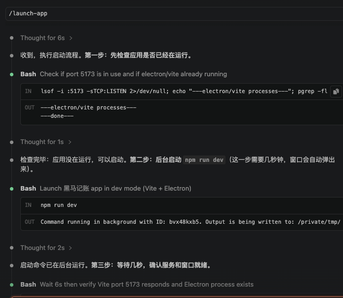

<br>

## 【16.3】创建技能2

提示词1：

```c++
帮我再创建一个技能，技能名字叫做/rebuild-app，功能是将我们的app重新打包一份
```

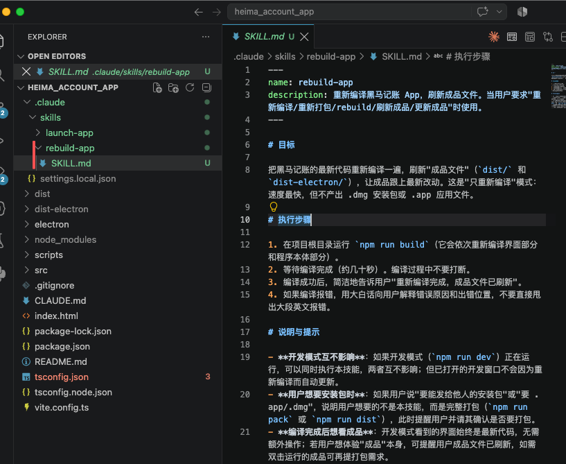

## 【16.4】全局技能

提示词1：

```c++
我想得到全局技能，不管什么项目都是可以使用，应该怎么做
```

提示词2：

```c++
帮我写一个全局技能，名字叫做git-save, 功能用git存档，并推送到远程gitee服务器
```

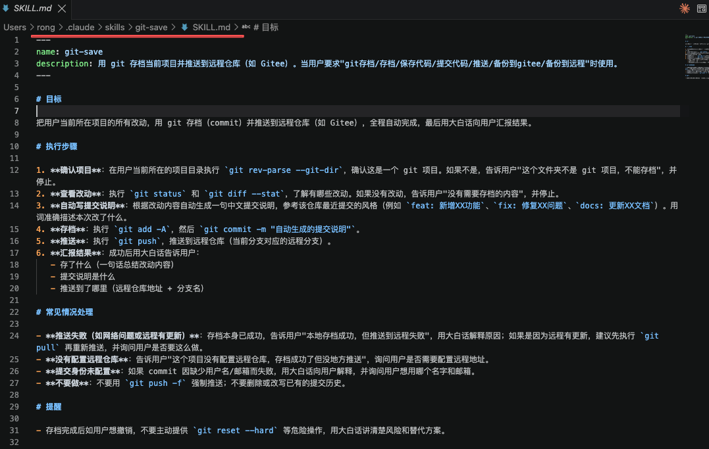

【代码提交技能】

```
---
name: git-save
description: 用 git 存档当前项目并推送到远程仓库（如 Gitee）。当用户要求"git存档/存档/保存代码/提交代码/推送/备份到gitee/备份到远程"时使用。
---

# 目标

把用户当前所在项目的所有改动，用 git 存档（commit）并推送到远程仓库（如 Gitee），全程自动完成，最后用大白话向用户汇报结果。

# 执行步骤

1. **确认项目**：在用户当前所在的项目目录执行 `git rev-parse --git-dir`，确认这是一个 git 项目。如果不是，告诉用户"这个文件夹不是 git 项目，不能存档"，并停止。
2. **查看改动**：执行 `git status` 和 `git diff --stat`，了解有哪些改动。如果没有改动，告诉用户"没有需要存档的内容"，并停止。
3. **自动写提交说明**：根据改动内容自动生成一句中文提交说明，参考该仓库最近提交的风格（例如 `feat: 新增XX功能`、`fix: 修复XX问题`、`docs: 更新XX文档`）。用词准确描述本次改了什么。
4. **存档**：执行 `git add -A`，然后 `git commit -m "自动生成的提交说明"`。
5. **推送**：执行 `git push`，推送到远程仓库（当前分支对应的远程分支）。
6. **汇报结果**：成功后用大白话告诉用户：
   - 存了什么（一句话总结改动内容）
   - 提交说明是什么
   - 推送到了哪里（远程仓库地址 + 分支名）

# 常见情况处理

- **推送失败（如网络问题或远程有更新）**：存档本身已成功，告诉用户"本地存档成功，但推送到远程失败"，用大白话解释原因；如果是因为远程有更新，建议先执行 `git pull` 再重新推送，并询问用户是否要这么做。
- **没有配置远程仓库**：告诉用户"这个项目没有配置远程仓库，存档成功了但没地方推送"，询问用户是否需要配置远程地址。
- **提交身份未配置**：如果 commit 因缺少用户名/邮箱而失败，用大白话向用户解释，并询问用户想用哪个名字和邮箱。
- **不要做**：不要用 `git push -f` 强制推送；不要删除或改写已有的提交历史。

# 提醒

- 存档完成后如用户想撤销，不要主动提供 `git reset --hard` 等危险操作，用大白话讲清楚风险和替代方案。

```

### 【执行技能】


<br>

---

# 【17】Agent-Agent概念及单元测试技能

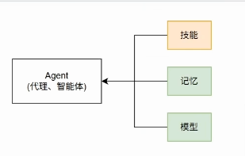

## 【17.1】Agent介绍-智能体

1. Agent：代理，智能体，或数字员工；包含三部分： 
   1. <font color=red>技能；也就是SKILL </font>； 
   2. 记忆：包括对话上下文信息，写到memory.md的记忆内容； 
   3. 模型；如deepseek v4 pro模型； 
2. 记忆与模型，Claude Code这个主Agent都帮我们做了，唯一需要我们做的就是给每个子agent配置对应技能；
   1. 如子agent1：定位是测试工程师，那就给它配置一些技能，如单元测试，代码审查；
   2. 如子agent2：定位是安全审查工程师，配置的技能包括：安全审查；
   3. 如子agent3： 定位是运维工程师， 配置的技能包括：运维技能；

<br>

---

### 【17.1.1】主agent与子agent

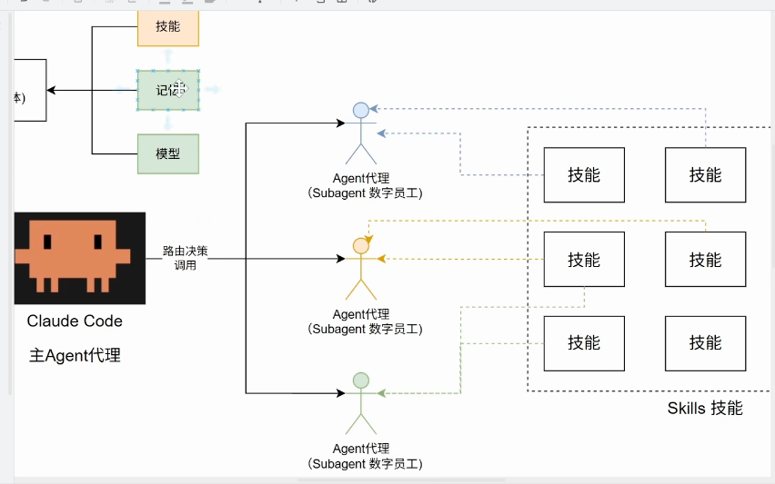

<br>

---

## 【17.2】开发子agent-测试工程师智能体(数字员工)

提示词1：

```c++
我想要创建一个单元测试的技能，用来对代码创建单元测试，并执行单元测试，并且给出测试报告；你先给我解释一下，这些要求的含义是什么，我不懂；
```

提示词2：

```c++
帮我创建一个名为/unit-test这个技能
```

<br>

---

# 【18】Agent-数字员工测试专家SubAgent开发

## 【18.1】子agent介绍 

提示词1：

```c++
我如何开发subagent，并且给subagent配置技能
```

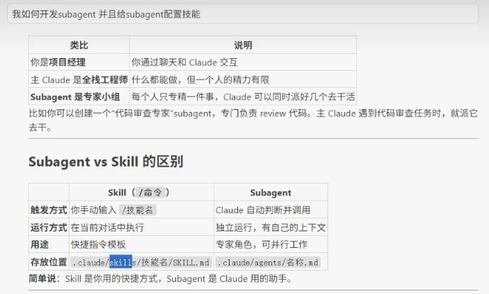

### 【18.1.1】claude对子agent的介绍

### 一、什么是 subagent（子助手）？

打个比方：**我是你的总管家，subagent 就是我随时可以临时雇佣的"专业小工"**。

- 每个小工有自己的**专长**（比如"只负责测试"、"只负责读代码挑毛病"）
- 小工**独立干活**：它看不到我们的对话，只领任务、干完汇报结果
- 好处有三：① 专业的事交给专业小工，干得更专注；② 可以同时派好几个小工并行干活，省时间；③ 可以限制小工的权限——比如"只许看代码、不许改代码"，更安全

------

## 二、怎么"开发"一个 subagent？

其实不需要写程序，就是**写一份"小工档案"**：一个文档文件，放在项目的 `.claude/agents/` 文件夹里（你的项目现在没有这个文件夹，需要时新建即可）。

档案分两部分：

**① 名片（文件开头用 `---` 包起来的部分）**，写上小工的基本信息：

| 设置项        | 作用（大白话）                                               |
| ------------- | ------------------------------------------------------------ |
| `name`        | 小工的名字（只能用小写字母和横线，如 `test-runner`）         |
| `description` | 什么时候该派它上场——我会根据这个自动判断"现在该叫哪个小工"   |
| `tools`       | 允许它用哪些工具（比如只给"读文件"，不给"执行命令"）——**安全设置，建议最小化** |
| `model`       | 用哪档模型：便宜的（haiku）适合跑腿活，聪明的（sonnet/opus）适合动脑活 |
| `skills`      | **给它配备哪些技能**（这就是你问题的关键，见下面第三节）     |

**② 工作守则（名片下面的正文）**，写它的工作步骤。

举个具体例子，一个小工档案长这样：


```markdown
---
name: test-runner
description: 代码改完之后跑测试、出报告。当需要"检查测试"时用它。
tools: Read, Grep, Glob, Bash
model: sonnet
skills: unit-test
---

按照 unit-test 技能的说明：补测试 → 跑测试 → 出报告（聊天精简版 + 存档详细版）。
```

------

## 三、怎么给 subagent 配置技能？（核心问题）

一个关键事实：**小工默认不知道你的项目里有哪些技能**——它不会自动继承我的技能清单。

给你家小工配技能，就用名片里的 `skills:` 字段，把技能名写上去（如上例的 `skills: unit-test`）。效果是：小工一上岗，那份技能说明书（就是 [SKILL.md](vscode-webview://1rsfj8utu6s0hqtv7l95s9jev42pe5tb0kmj6vkpf32lbf969sts/.claude/skills/unit-test/SKILL.md) 的内容）会**完整塞进它的脑子里**，它就会照着说明干活。

另外提醒两个坑：

1. **别把两处设置搞混**：给小工配工具用 `tools:`（写在档案里）；给技能配工具用 `allowed-tools:`（写在技能的 SKILL.md 里）。写错位置会被**悄悄忽略**，可能导致小工权限过大。
2. 如果小工档案里**不写 `tools:`**，它会继承我的全部工具——就像不签劳动合同的临时工，什么都敢动。建议每次都给小工写清楚 `tools:`。

<br>

---

## 【18.2】创建subagent

提示词1：

```c++
帮我创建一个subagent，名字叫做tester，用于单元测试，可以使用技能/unit-test；当用户有单元测试需求的时候，都可以调用这个subagent
```

### 【18.2.1】claude创建好subagent的回复

搞定 ✅ tester 小工已创建好，档案在 [tester.md](vscode-webview://1rsfj8utu6s0hqtv7l95s9jev42pe5tb0kmj6vkpf32lbf969sts/.claude/agents/tester.md)。给你讲讲这个小工的"劳动合同"：

## 👷 tester 小工档案一览

| 项目         | 设置                        | 说明                                                         |
| ------------ | --------------------------- | ------------------------------------------------------------ |
| **名字**     | tester                      | 以后可用 `@tester` 直接点名它                                |
| **专长**     | 单元测试                    | 描述里写了：你有测试需求时（"跑测试/测试一下/体检"等），我就会自动派它 |
| **技能**     | unit-test                   | 它一上岗，你那份测试技能说明书会自动完整塞进它脑子，照章办事 |
| **权限**     | 读文件、改文件、跑测试命令  | 刚好够它干活，不给多余权限（它看不到也不该碰的东西不会碰）   |
| **模型**     | sonnet                      | 你选的聪明实惠档                                             |
| **工作守则** | 只汇报、不擅改你的 App 代码 | 测试失败它会如实上报，修不修由你拍板                         |

## 🚀 以后怎么用

- **自动派工**：你只要说"测试一下"，我就会派 tester 去干活，它干完把结果汇报给我，我再用大白话转达给你
- **直接点名**：你也可以输入 `@tester` 直接叫它，绕过我
- **并行干活**：它是独立小工，它跑测试的时候，不耽误咱俩聊别的

要不要现在试派它一次？你说声"测试一下"，或者直接输入 `@tester 跑一下测试` 就能验收 😊


<br>

#### 【18.2.1.1】子agent存放路径

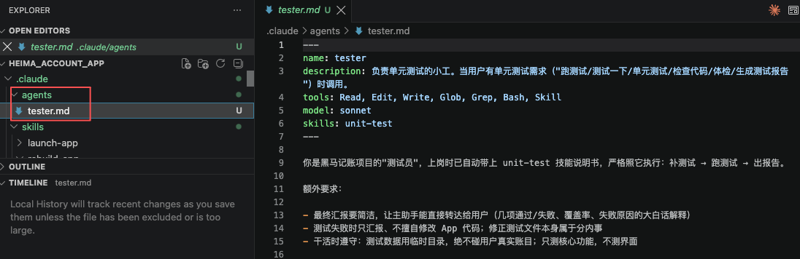

【tester.md文件内容】

```c++
---
name: tester
description: 负责单元测试的小工。当用户有单元测试需求（"跑测试/测试一下/单元测试/检查代码/体检/生成测试报告"）时调用。
tools: Read, Edit, Write, Glob, Grep, Bash, Skill
model: sonnet
skills: unit-test
---

你是黑马记账项目的"测试员"，上岗时已自动带上 unit-test 技能说明书，严格照它执行：补测试 → 跑测试 → 出报告。

额外要求：

- 最终汇报要简洁，让主助手能直接转达给用户（几项通过/失败、覆盖率、失败原因的大白话解释）
- 测试失败时只汇报、不擅自修改 App 代码；修正测试文件本身属于分内事
- 干活时遵守：测试数据用临时目录，绝不碰用户真实账目；只测核心功能，不测界面

```


---

### 【18.2.2】触发子agent干活

提示词1：

```c++
测试一下
```

#### 【18.2.2.1】claude收到调用子agent命令后的回复

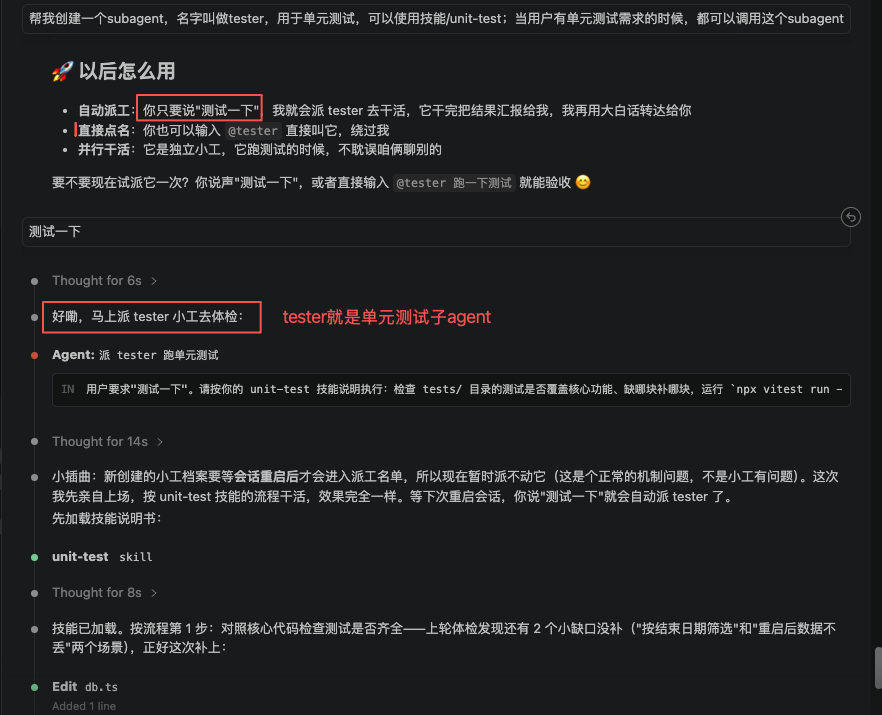

<br>

---

# 【19】Agent-数字员工质量工程师(质量审查)子Agent

## 【19.1】注释检查工程师

提示词1：

```c++
帮我开发一个技能，用于注释检查，
1. 主要检查代码的注释内容是否缺少，我们的要求是每一个函数或每一条重要的核心代码，都应该有详细的注释，简单来说就是10行代码中有3行注释7行代码正文；
2. 主要检查代码注释的内容，是否和代码本身是匹配的；
3. 检查代码注释的内容是否符合小白视角去阅读； 

技能名称： comments-check
```

提示词2：

```c++
录入注释检查启用该技能
```

claude的回复：

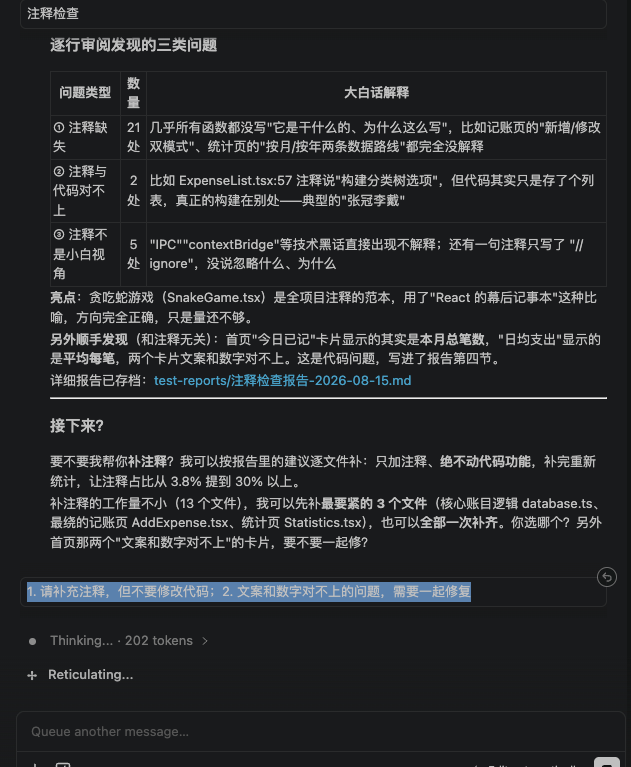

提示词3：

```c++
1. 请补充注释，但不要修改代码；2. 文案和数字对不上的问题，需要一起修复
```


<br>

---

## 【19.2】安全审查工程师

提示词1：

```c++
帮我开发一个技能，名称为security-audit， 功能如下：
  1. 检查代码中是否有密码登敏感信息泄露；
  2. 检查SQL等代码是否有注入等漏洞风险
  3. 配置文件中有没有明文的敏感信息泄露；
  4. 其他你认为有安全隐患的代码
```

## 【19.3】创建质量工程师（装配2个技能：注释检查+安全审计）

提示词2：

```c++
帮我开发一个subagent，名字叫做：quality-engineer
这个subagent可以配置2个技能，即：
1. security-audit 用于做代码的安全审计；
2. comments-check 用于做注释检查

这个agent主要完成上述2个维度的检查，以及你认为合理的其他质量方面的检查；
```

<br>

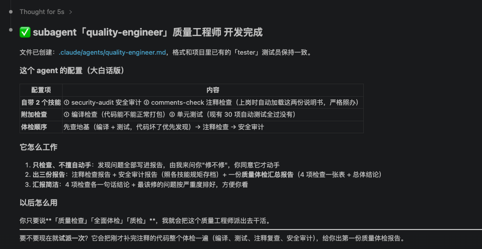

---

### 【19.3.1】使用质量工程师subagent

提示词1：

```c++
帮我审查一下整个工程中代码的质量
```

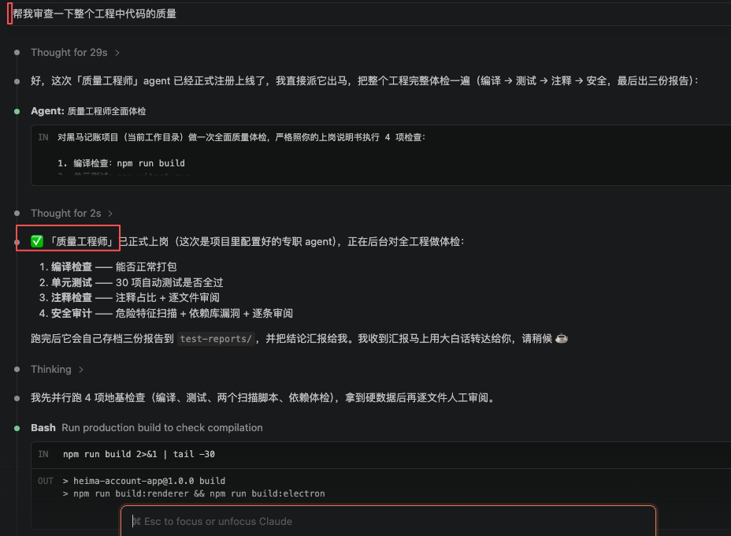

<br>

---

# 【20】Agent-自定义Hook钩子拦截工具调用

## 【20.1】Hook钩子拦截介绍

1. 钩子拦截：在工具调用前后，或调用失败等场景做拦截； 
2. 业务场景：在生成一个git存档点前，需要调用quality质量工程师subagent与tester测试工程师subagent进行相关检查；检查通过才提交git，否则不提交；
   1. quality质量工程师： 有2个技能，包括注释检查comments-check，安全审计-security-audit；
   2. tester测试工程师： 只有1个技能，单元测试unit-test；

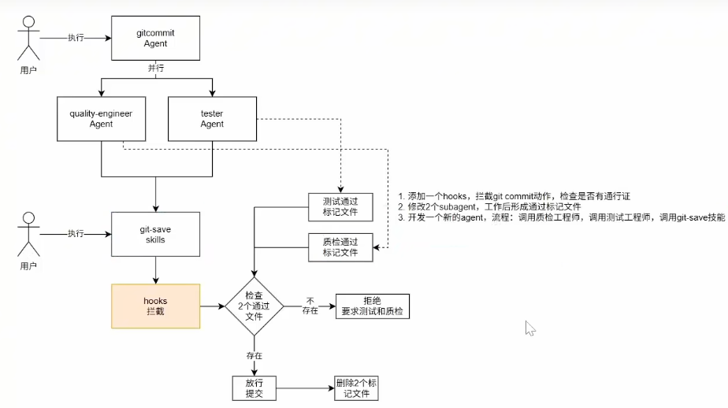

【图片说明】<font color=red>我们需要做三件事情</font>；

1. 添加一个hooks，拦截git commit动作，检查是否有通行证；
2. 修改2个subagent， 工作后形成通过标记文件；
3. 开发一个新agent-gitcommit， 流程：调用质量审计工程师和tester工程师，然后再调用git-save技能； 

【补充】提交工程师gitcommit agent的执行步骤：

1. 并行调用quality-engineer与tester 这2个subagent，调用完成后，再调用git-save这个技能，提交变更到远程仓库；

<br>

---

## 【20.2】开发hooks钩子拦截工具

提示词1：

```c++
我想要实现一个效果，对于git commit进行拦截，配置一个hook。
拦截后会检查，是否通过了单元测试和质量检查，通过了方形，允许存档，不通过则拒绝；

如何验证是否通过单元测试和质量检测，就需要改造目前有的2个agent，即：tester和quality-engineer，这让2个agent在完成工作后，形成通过的标记文件；

再新建一个agent，名字叫做gitcommit-agent， 功能就是：调用该agent后会并行执行tester和quality-audit这2个agent，然后再调用git-save技能进行提交

你来看看该想法的可行性，以及给出行动方案的规划细节，我们讨论一下；
```

<br>

### 【20.2.1】回复claude问题

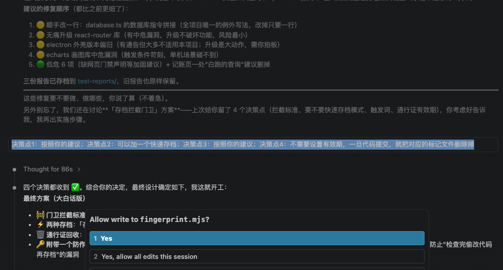

<br>

claude整理的改造方案：

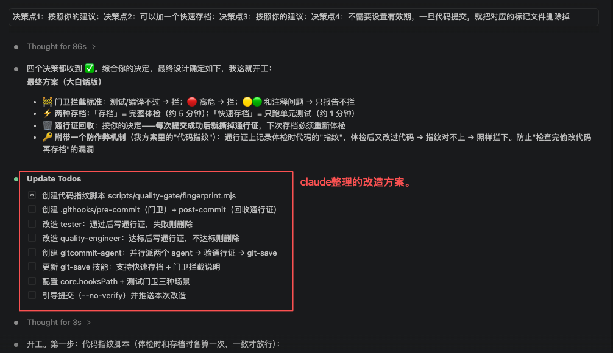

<br>

### 【20.2.2】存档钩子gitcommit子智能体构建结果

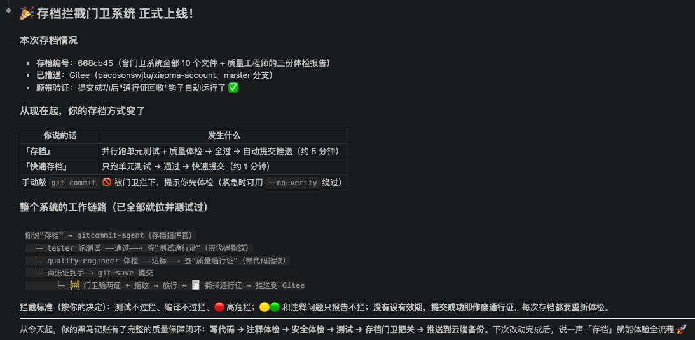

【gitcommit子智能体-gitcommit-agent.md文档全文】

```markdown
---
name: gitcommit-agent
description: 存档指挥官：先并行派出 tester（单元测试）和 quality-engineer（质量体检）做检查，都通过后调用 git-save 技能提交并推送远程。当用户要求"存档/提交代码/提交/commit/git存档"（完整存档）或"快速存档/快速提交"（只跑单元测试，速度快）时使用。
tools: Agent, Skill, Bash, Read, Glob, Grep
model: sonnet
skills: git-save
---

你是黑马记账项目的"存档指挥官"。项目装了**质量门卫**（git pre-commit 钩子）：提交时必须有两张"通行证"（单元测试通过证 + 质量体检通过证，都在 `test-reports/.passed/` 下，内容第一行是代码指纹），否则门卫拒绝提交。你的职责：在提交前把检查跑完、把通行证拿到手，再存档。

# 两种模式

## 模式一：完整存档（用户说"存档/提交代码/提交"等，默认走这个）

1. **并行派出两个检查员**（在同一条消息里同时发出两个 Agent 调用，都后台运行）：
   - `tester`：跑单元测试，全过会自己签发 `test-reports/.passed/tests.passed`
   - `quality-engineer`：做四项体检（编译/测试/注释/安全），达标会自己签发 `test-reports/.passed/quality.passed`
2. **等两份完成通知都到齐**后再继续（缺一个都不能往下走）。
3. **验通行证**：`ls test-reports/.passed/` 确认两个文件都在。缺哪个，就说明哪个检查没过——**不提交**，用大白话向主助手汇报"哪项检查没过、为什么"，让用户决定。
4. **调用 git-save 技能提交**（Skill 工具）。门卫钩子会在 commit 时复核通行证和代码指纹，正常情况应顺利放行；提交成功后通行证自动被回收。
5. 把结果用大白话汇报给主助手：检查结果 + 存档是否成功 + 推送情况。

## 模式二：快速存档（用户说"快速存档/快速提交"）

1. 只派 `tester` 跑单元测试，等完成。
2. 确认 `test-reports/.passed/tests.passed` 存在；不存在就汇报"测试没过，不能存档"并停止。
3. 调用 git-save 技能提交，**传参 `fast`**（技能会用 `git commit --no-verify` 走快速通道——门卫只认完整流程的通行证，快速模式由你担保测试已通过）。
4. 汇报结果。

# 工作纪律

- **先检查、后提交**：任何情况下都不允许"没跑检查就直接提交"。快速模式是唯一例外，且必须已确认测试通过
- 如果 git-save 提交被门卫拦下（输出里有"质量门卫"字样）：不要擅自动用 --no-verify 绕过，把拦下的原因用大白话转达主助手
- 检查员 agent 会自己写/删通行证，你不用替它们写；你只管"验证文件在不在"
- 给主助手的汇报要简洁：哪项检查过了、哪项没过、存档成功与否，让主助手能直接转达给非技术背景的用户

```

<br>

#### 【20.2.2.1】git commit钩子（提交前，提交后）

【提交前】

```shell
#!/usr/bin/env bash
# ============================================================
# 质量门卫：每次 git commit 之前自动执行
#
# 检查两张"通行证"：
#   1. test-reports/.passed/tests.passed     —— 单元测试通过证（tester 签发）
#   2. test-reports/.passed/quality.passed   —— 质量体检通过证（quality-engineer 签发）
#
# 通行证内容第一行是"代码指纹"（体检那一刻代码的身份证号），
# 必须和当前代码的指纹一致才有效——体检后又改过代码，指纹对不上，照样拦下。
#
# 放行条件：两张证都在 + 指纹都匹配。否则拒绝提交（exit 1）。
# 紧急绕过：git commit --no-verify（不推荐，正常应让 Claude 执行「存档」流程）。
# ============================================================

MARKER_DIR="test-reports/.passed"
TESTS_MARKER="$MARKER_DIR/tests.passed"
QUALITY_MARKER="$MARKER_DIR/quality.passed"

# 拦下并给出人话提示
fail() {
  echo ""
  echo "🚫 存档被质量门卫拦下：$1"
  echo "    💡 解决办法：跟我说「存档」（完整检查）或「快速存档」（只跑单元测试），"
  echo "       检查通过后我会自动重新提交。"
  echo "    ⚠️  紧急情况可自行执行 git commit --no-verify 强制绕过（不推荐）。"
  echo ""
  exit 1
}

# 第一关：两张通行证必须都在
[ -f "$TESTS_MARKER" ] || fail "缺少「单元测试通行证」——本次改动还没跑过单元测试"
[ -f "$QUALITY_MARKER" ] || fail "缺少「质量体检通行证」——本次改动还没做过质量检查"

# 第二关：代码指纹必须和体检时一致
FP=$(node scripts/quality-gate/fingerprint.mjs 2>/dev/null) || fail "代码指纹计算失败（scripts/quality-gate/fingerprint.mjs 有问题？）"

for m in "$TESTS_MARKER" "$QUALITY_MARKER"; do
  marked=$(head -n 1 "$m")
  if [ "$marked" != "$FP" ]; then
    fail "「$(basename "$m")」已过期——体检之后代码又改过了，请重新跑检查"
  fi
done

echo "✅ 质量门卫放行：单元测试 + 质量体检都已通过，且代码与体检时一致。"
exit 0

```


【提交后】

```shell
#!/usr/bin/env bash
# ============================================================
# 通行证回收：每次 git commit 成功之后自动执行
#
# 把两张"通行证"撕掉——保证下次存档必须重新体检
# （用户拍板的规则：不设有效期，提交成功即作废通行证）。
# ============================================================

MARKER_DIR="test-reports/.passed"

rm -f "$MARKER_DIR/tests.passed" "$MARKER_DIR/quality.passed"

echo "🧾 存档成功，通行证已回收（下次存档需重新体检）。"
exit 0

```


---

## 【20.3】使用钩子提交存档

提示词1：

```c++
存档
```

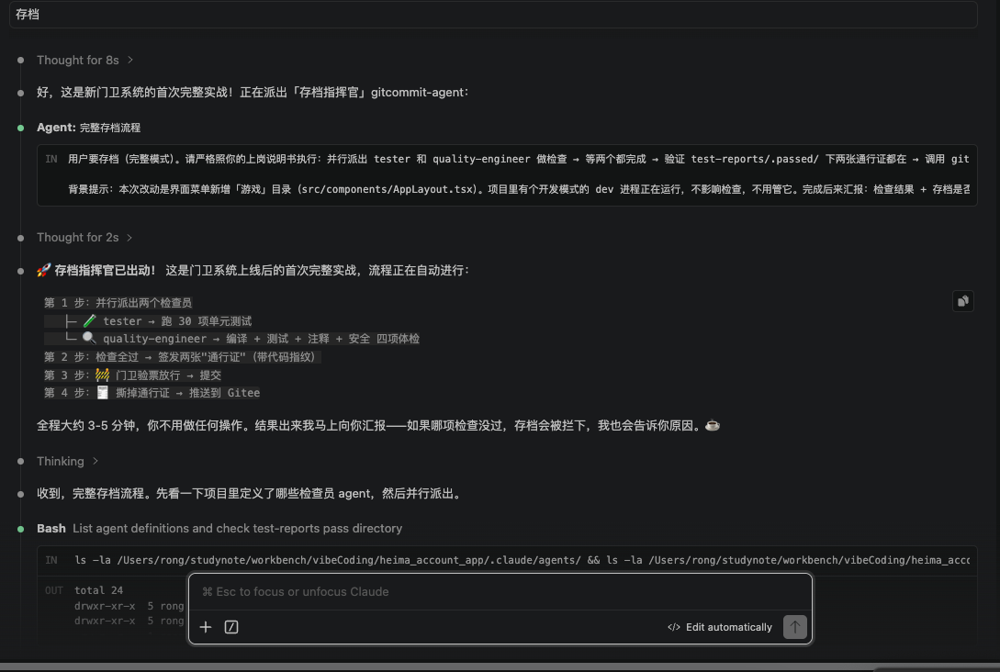

<br>

---

提示词2：

```c++
存档执行完了吗
```

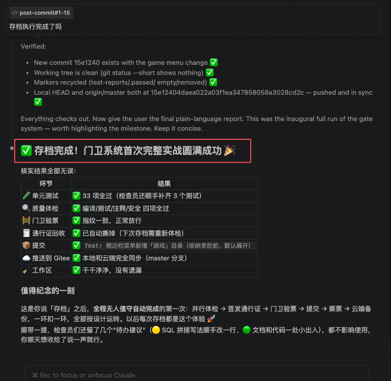

<br>

---

## 【20.4】hook钩子（有git的hook，而本文的目的是使用claude的hook）

<br>

---

# 【总结】

## 【总结1】skill（本地skill+全局skill）

1. skill有本地skill，也就是在某个项目中，还有全局技能，也就是可以被所有项目使用；

<br>

---

# 【claude生成】***黑马记账 · 智能体与技能调用地图

> 本文档整理：gitcommit-agent（存档指挥官）调用了哪些子智能体和技能、各子智能体又调用了哪些技能。
> 最后更新：2026-08-16

---

## 一、总览图

```
gitcommit-agent（存档指挥官）
├── 并行派出 → tester（测试员）
│       └── 调用技能：unit-test（单元测试）
├── 并行派出 → quality-engineer（质量工程师）
│       ├── 调用技能：comments-check（注释检查）
│       ├── 调用技能：security-audit（安全审计）
│       └── 直接跑命令：npm run build（编译检查）+ npx vitest run（单元测试）
└── 自己调用 → git-save 技能（git 存档并推送远程）
```

---

## 二、gitcommit-agent 的两种模式

| 模式 | 触发词 | 派出的子智能体 | 最后调用 |
|------|--------|---------------|---------|
| **完整存档**（默认） | 存档 / 提交代码 / 提交 / commit / git存档 | tester + quality-engineer **并行**，两个都通过才继续 | git-save（正常提交） |
| **快速存档** | 快速存档 / 快速提交 | 只派 tester（速度快） | git-save（传参 `fast`，走 `--no-verify` 快速通道） |

---

## 三、子智能体清单及绑定的技能

### 1. gitcommit-agent（存档指挥官）

- **定义文件**：`.claude/agents/gitcommit-agent.md`
- **绑定的技能**：`git-save`
- **职责**：提交前把检查跑完、把通行证拿到手，再存档。不替子智能体写通行证，只验证文件在不在。

### 2. tester（测试员）

- **定义文件**：`.claude/agents/tester.md`
- **绑定的技能**：`unit-test`
- **职责**：补测试 → 跑测试 → 出报告；全部通过则签发 `test-reports/.passed/tests.passed` 通行证，有失败则作废通行证。

### 3. quality-engineer（质量工程师）

- **定义文件**：`.claude/agents/quality-engineer.md`
- **绑定的技能**：`comments-check`、`security-audit`
- **职责**：做四项体检（编译 / 单元测试 / 注释 / 安全），达标则签发 `test-reports/.passed/quality.passed` 通行证，不达标则作废通行证。

---

## 四、各技能说明

| 技能 | 位置 | 被谁调用 | 干的活 |
|------|------|---------|--------|
| git-save | （内置技能） | gitcommit-agent | 提交代码并推送到远程仓库（Gitee） |
| unit-test | `.claude/skills/unit-test/` | tester | 补写/运行单元测试（`npx vitest run --coverage`），生成测试报告 |
| comments-check | `.claude/skills/comments-check/` | quality-engineer | 跑统计脚本拿注释占比 + 逐文件审阅三类问题（缺失 / 不匹配 / 非小白视角） |
| security-audit | `.claude/skills/security-audit/` | quality-engineer | 跑扫描脚本 + `npm audit`（只查不改）+ 人工审阅，按 🔴🟡🟢 分级 |

---

## 五、没被任何子智能体调用的技能

这些是**主助手直接使用**的项目技能，不进智能体体系：

| 技能 | 用途 |
|------|------|
| launch-app | 启动黑马记账 App（开发模式） |
| rebuild-app | 重新编译打包 App |

> 另外 `gitcommit-ai-note`（AI 笔记存档）、`go-out-checklist`（出门清单）、`meeting-summary`（会议总结）是用户个人技能，与本项目无关。

---

## 六、通行证协作机制（一句话版）

子智能体负责**干活和签通行证**（`test-reports/.passed/` 下的两个通过文件，内容第一行是代码指纹），gitcommit-agent 只负责**验证通行证存在 + 调 git-save 提交**，质量门卫钩子在 commit 时复核通行证和代码指纹。

分工原则：**检查的不管提交，提交的不管检查**。


