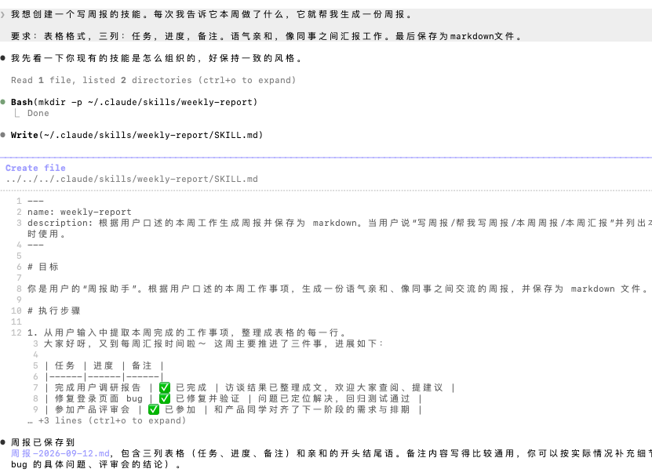
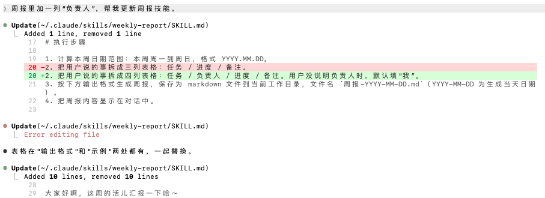
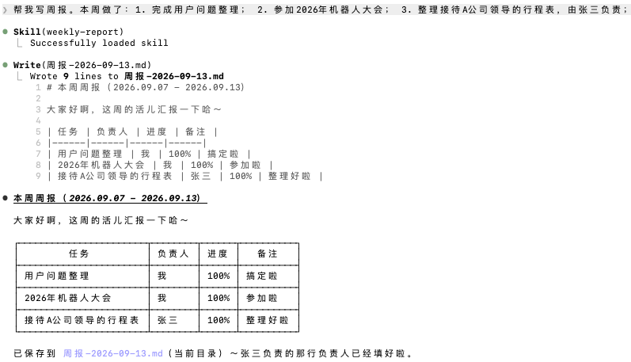
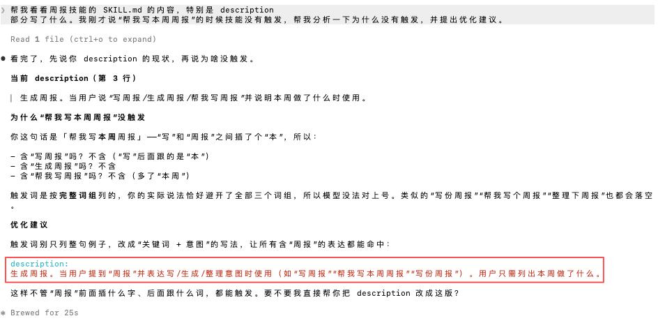
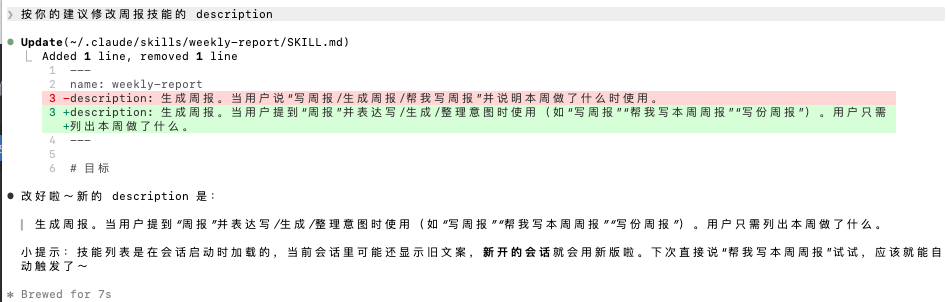
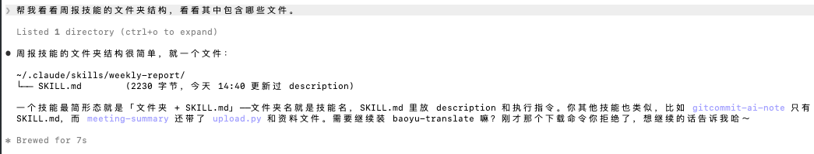
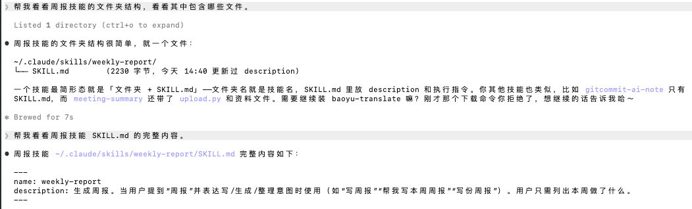

# 【README】

本文总结自《图解skill——AI提效实战指南》

---

# 【1】跑通第一个技能

## 【1.2】跑通第一个技能

### 【1.2.1】不用技能

```c++
帮我写一份本周周报，本周做了三件事：
  1. 完成用户调研报告
  2. 修复登录页面的bug
  3. 参加产品评审会
  
  要求：表格格式，三列（任务，进度，备注），语气亲和，保存成markdown文件。
```

### 【1.2.2】创建技能(两种方法)

#### 【1.2.2.1】方法1：使用 /skill-creator 技能创建

1. 需求清晰，直接创建：使用claude code中内置的 /skill-creator 技能创建技能；
   1. <font color=red>skill-creator：是一个创建技能的技能</font>；

【创建周报skill的提示词】

```c++
我想创建一个写周报的技能。每次我告诉它本周做了什么，它就帮我生成一份周报。
  
要求：表格格式，三列：任务，进度，备注。语气亲和，像同事之间汇报工作。最后保存为markdown文件。
```



#### 【1.2.2.2】方法2：先对话调试，再固话为技能

步骤1：让智能体帮忙写周报：

```c++
帮我写一份本周周报。本周做了：完成用户调研报告，修复登录页面bug，参加产品评审会。
```

步骤2：调试技能（看到输出后，觉得哪里不对就直接说）：

```c++
1. 把进度修改为百分比的形式；2. 语气太正式了，修改为同事之间汇报工作的语气。3. 周报还是保存为markdown格式文件
```

步骤3（关键的一步）-生成技能：不要退出当前会话，直接对智能体说：

```c++
这份周报的格式和风格我都很满意。帮我基于咱们刚才的对话，把这些要求固话为一个周报技能。以后我只需要告诉你做了什么事，你就按这个标准生成周报。
```

生成周报技能；

#### 【1.2.2.3】让智能体修改技能

提示词：

```c++
周报里加一列“负责人”，帮我更新周报技能。
```



使用刚刚生成的周报技能编写周报：

```
帮我写周报。本周做了：1. 完成用户问题整理； 2. 参加2026年机器人大会； 3. 整理接待A公司领导的行程表，由张三负责；
```



<br>

### 【1.2.3】技能没有生效怎么办？

第1步：确认技能已经安装

```c++
你现在有哪些可用的技能？列出来给我看看。
```

第2步：确认智能体已重启。

第3步：检查description

```c++
帮我看看周报技能的 SKILL.md 的内容，特别是 description 部分写了什么。我刚才说“帮我写本周周报”的时候技能没有触发，帮我分析一下为什么没有触发，并提出优化建议。
```



第4步：确认建议合理后，让智能体直接修改：

```c++
按你的建议修改周报技能的 description
```



<br>

#### 【1.2.3.1】跑通你的第一个技能总结(提交AI学习笔记)

1. 通过以下步骤创建，使用并优化你的 第一个技能：
   1. 选择其中一个方式创建技能；如 提交ai学习笔记 的技能；
   2. 让智能体确认技能已创建，看看文件路径和内容；
   3. 重启智能体，加载新技能；

【提示词】

```c++
帮我看看 提交AI学习笔记 技能的文件路径和内容
```


<br>

### 【1.2.4】安装别人的技能

提示词：

```c++
请帮我安装 github.com/jimliu/baoyu-skills 里的 baoyu-translate skill
```

<br>

---

## 【1.3】打开技能文件夹看看

看技能文件夹结构：

```c++
帮我看看周报技能的文件夹结构，看看其中包含哪些文件。
```



### 【1.3.2】SKILL.md的三个部分

提示词：

```c++
帮我看看周报技能 SKILL.md 的完整内容。
```



<br>

#### 三个部分

1. name： 技能名称，也是文件夹名称；
2. description： 技能的简介，一两句话说清楚“技能是干什么的，以及什么时候使用”
3. 正文：第二个 --- 之后的内容，具体的操作步骤和规则，其中可能包括执行流程，输出要求和检查清单等； 

<br>

### 【1.3.3】技能存放在哪里

1. 按层级划分：
   1. 全局技能；
   2. 项目技能；

<br>

---

# 【2】理解技能运行的核心逻辑

## 【2.1】智能体的六大要素

### AI聊天机器人与智能体的不同

1. AI聊天机器人：美食顾问，它知道菜谱，但它没有厨房；无论它说的有多好，最后切菜炒菜还是你自己干；
2. 智能体：一个由AI厨师坐镇的厨房系统；
3. <font color=red>AI聊天机器人与智能体区别总结</font>：
   1. AI 聊天机器人=大模型+上下文（有脑子和记忆，但只能纸上谈兵）
   2. 智能体=大模型+上下文+工具+技能（不仅有脑子和记忆，还配齐了工具和操作说明，能够真正动手干活）；

### 智能体六大要素总结（重要）：

1. 智能体有六大核心要素：
   1. 大模型；
   2. 上下文
   3. 工具
   4. 技能；
   5. 指令（提示词）：触发智能体干活的指令；
   6. MCP： 方便智能体接入工具的通用插座；

### 【2.1.1】提示词：你对厨师下的指令

1. 提示词最大特点： 临时性； 因为它只在当前对话中生效； 
2. 提示词： 可以用来下达个性化要求，但不具备跨对话自动生效的能力；

### 【2.1.2】大模型：厨师

1. 大模型：是整个智能体系统的大脑与执行者；

### 【2.1.3】上下文：厨房台面

1. 厨师下厨离不开厨房台面：食材，调料，菜谱，盘子，所有当下要用到的东西都得摆在这块台面上；
2. 上下文：大模型的工作记忆；
   1. 你与智能体对话，当前加载的技能名片，调用工具返回的结果等，都临时放在这块空间里；
   2. 这块记忆空间本身是有限的（它的容量上限就是上下文窗口），往里面放的东西越多，剩余空间就越少；

### 【2.1.4】工具：厨房用具

1. 工具，分为内置工具和扩展工具：
   1. 内置工具：智能体原生具备的基础能力（如读写文件，执行代码，搜索网页）
   2. <font color=red>扩展工具：智能体需要通过特定接口（如插件，API或协议）才能调用的外部能力（如操作浏览器，连接数据库，对接飞书）</font>；

### 【2.1.5】技能：菜谱（大模型使用的操作手册）

1. 技能：就向写给厨师看的菜谱，是写给大模型使用的操作手册；
2. Anthropic公司对技能的定义：技能是一组有组织的文件集合，为智能体打包可组合的流程性知识；
   1. 流程性知识：怎么把一件事做好的知识，如流程，规范和检查清单等；

#### 【2.1.5.1】技能到底是给谁用的？

1. 把智能体拆分为两部分：
   1. 核心的大模型；
   2. 提供支持的智能体运行框架，后称框架；
2. <font color=red>在调用技能时，框架和大模型有明确的分工</font>：
   1. <font color=red>框架负责递本子和跑代码</font>：框架会将 SKILL.md 文件中的内容，以及任务所需的参数文档提取出来，像递本子一样发送给大模型；
      1. 但需要注意：如果技能里包含具体脚本（如python代码），这些代码完全由框架直接在本地运行，不经过大模型；
   2. <font color=red>大模型负责读本子和下指令</font>：大模型负责阅读递过来的SKILL.md 的内容和参考文档，理解任务的步骤和规则。
      1. 弄懂之后， 它会输出一条具体的指令，告诉框架去触发哪个底层脚本；

#### 【2.1.5.2】Anthropic官方对技能的定义

1. 一个完整的技能包：把专供大模型阅读的核心说明书，知识资料等与框架直接运行的脚步打包在一起（只有 SKILL.md 是必需的，其他均为可选）;

### 【2.1.6】MCP：通用插座

1. 背景：智能体需要对接各种外部工具，如数据库，邮件系统，日历，飞书等；这些工具各有各的使用方式，如果每个都要单独适配，无论是用户还是工具厂商，都会乱套；
2. <font color=red>MCP-模型上下文协议：就是为解决这个问题而生的，可以把它理解为AI世界的通用插座</font>；
   1. MCP是一套统一的对接标准，让不同的外部工具，无论是数据库，邮件系统，还是网盘，都能够用同一种方式接入智能体；
   2. 由来MCP这个通用插座， 工具厂商只需要适配一次MCP，所有支持MCP的智能体就都能够用上它的工具；
      1. 智能体也只需要支持一次，就能够对接所有适配了MCP的外部工具； 

#### 【2.1.6.1】工具，技能和MCP的关系

1. 工具，技能和MCP的关系：
   1. 工具让智能体动手干活；
   2. 技能教智能体具体怎么做； 
   3. MCP让各种外部工具无缝接入；

#### 【补充】人类指令 vs 大模型指令

1. 语言格式不同：
   1. 人类指令：人类下达给大模型的指令叫做提示词，用的是人类大白话；【人机沟通】
   2. 大模型指令：大模型下达给框架的指令，是一串结构化的数据格式（比如{"action":"search_weather", "date":"tomorrow"}）；【机器内部协作】
2. <font color=red>身份视角不同</font>：
   1. 大模型：是听从安排的厨师，负责接收你的目标；
   2. 当它转身面对触发设施（框架）时，它就成了发号施令的大脑，负责把目标拆解成具体的工作；

<br>

---

## 【2.2】技能比提示词强在哪里

### 【2.2.2】四大进化（技能比提示词强在哪里的具体表现）

1. 四大进化：
   1. 进化一：打破全量塞入的容量限制，实现按需加载；
   2. 进化二：突破上下文边界，让文件系统成为持久化工作台；
      1. 使用提示词，上下文就是唯一的工作空间；
      2. 智能体配合技能就不一样，中间结果可以随时存储为独立的文件；
         1. 上下文不再是唯一的工作空间，文件系统成了智能体的外部记忆和工作台；
   3. 进化三：摆脱单打独斗，构建协同工作流；
      1. 提示词：单打独斗；
      2. 技能：则可以串成工作流； 
         1. 拿翻译举例：素材分析技能提取核心观点，翻译技能完成翻译，润色技能完成整体校对，文章配图技能为文章添加插图和封面图；（<font color=red>3个技能各司其职，上一个做完下一个接手，这是最符合直接的组合方式</font>）
         2. <font color=red>技能还可以包含脚本，用来处理硬规则性任务</font>；
   4. 进化四：告别碎片化维护，积累经验复利；
      1. 技能以独立文件存在的，而且只有唯一的一份，这意味着它拥有软件工程中常说的单一信源；
      2. 单一信源，原地迭代，改完全局生效，再加上文件天然支持版本管理，你的业务经验可以一直积累下去；

## 【2.3】上下文与按需加载

### 【2.3.1】对话越长，可用空间越少

### 【2.3.2】按需加载：用到什么才拿什么

1. 技能靠的是按需加载策略，官方的专业叫法是渐进式披露：系统不会把所有技能文件一起塞进上下文，而是将其拆分为三层；
   1. 第1层：技能名片（YAML前置信息）
   2. 第2层：技能核心说明书正文（SKILL.md 正文）
   3. 第3层：技能配套资源包（关联文件）；
      1. 参考文档，放入 reference 目录；
      2. 脚本，放入 scripts 目录；
      3. 静态资源，放入 assets 目录；

#### 【2.3.2.1】触发动作与开销

1. 对于参考文档（按需读取）：智能体只有在执行到对应步骤时，才会触发读取动作；不走到那一步，绝不加载；
2. 对于脚本（沙盒运行）：繁重的计算过程完全在上下文之外的独立沙盒中运行，绝不挤占大模型的工作记忆；

<br>

### 【2.3.3】管理上下文的三个技巧

1. 三个技巧：
   1. 技巧1： 按需启用， 严格控制常驻技能的数量； 
   2. 技巧2：主文件（ SKILL.md），必须克制；
      1. 官方明确建议：把 SKILL.md 的正文长度控制在 5000个词元以内（换算成中文，大约不超过3800字），行数不超过500行；
   3. 技巧3：适时开启新对话以清空工作记忆；
      1. SKILL.md 主文件一旦被读取， 就会一直留在那一轮对话的上下文中，挤占工作记忆空间，直到对话结束；
      2. 解决方法： 直接开启一个新对话。 这相当于清空工作记忆，让智能体轻装上阵，重新开始；

## 【2.4】description： 技能被选中的关键机制

### 【2.4.1】智能体式如何相中技能的

1. 你安装的所有技能的 description， 会在智能体启动的瞬间，直接被注入大模型的系统提示词中；
   1. 所以： description的首要读者：是AI，不是人；
   2. 大模型决定要不要调用一个技能的唯一决策：依据的是技能的 description ；

### 【2.4.3】如何写出好的description

1. 极简公式：description =  功能定义  +  触发场景/ 触发词；
   1. 功能定义： 这个技能是用来干什么的；
   2. 触发场景/触发词： 什么时候使用这个技能；
2. 示例：
   1. 生成结构化的工作周报。当用户要求撰写周报，工作总结，工作汇报等内容时使用。

#### 【2.4.3.1】高阶使用：使用反向触发词避免技能抢活

基础写法：

```c++
description: 将文章翻译为目标语言。当用户需要翻译时使用
```

加反向触发词：

```c++
description：将文章翻译为目标语言。当用户需要翻译文章，网页内容哦时使用。不用于润色已有中文内容，不用于改写或摘要。
```

<br>

---

# 【3】从任务到技能五步走

1. 经验总结： 不是所有任务都适合固话为技能，技能也不是越复杂越好；
   1. <font color=red>创建技能前的五件事</font>：
      1. 一个任务该怎么拆；
      2. 哪些环节值得固化成技能；
      3. 哪些活应该交给模型；
      4. 哪些活交给脚本；
      5. 选什么工具干活；

## 【3.1】先把任务拆开看

### 【3.1.1】任何任务拆成三类操作

1. 任务拆分为三类操作：
   1. 执行规则类操作；规矩定过一次，后面每次都一样；如照着菜谱做；
      1. 如标题格式，图表配色，数据精度保留两位小数，结论段必须先写核心发现再写建议等；
   2. 判断类操作；没有固定答案，得看情况来做判断或决策，如决定鱼是清蒸还是红烧；
   3. 调用外援类操作（外部调用）；智能体没有工具，需要连外部；如去外面市场买条鲈鱼；
      1. 原始数据不在本地，在公司数据库里，智能体需要通过某种方式连接上去，还需要知道查询哪张表，哪些字段；

<br>

### 【3.1.2】三种设计模式

1. 三类操作对应三种设计模式，如下：
   1. 执行规则类操作： 对应标准化输出设计模式； 如写周报，发邮件，出标准化报告；
      1. <font color=red>情况1：规则完全固定，要求100%准确，交给脚本做</font>；如数据清洗（剔除空值，统一日期格式）
      2. <font color=red>情况2： 有规则，但没有准确的统一标准；把格式写进SKILL.md</font>；如润色文字，总结结论；
   2. 判断类： 对应流程自动化设计模式；如简历初筛，数据分析；
      1. <font color=red>交给模型来推理</font>；
   3. 调外援： 对应工具增强设计模式；如连接数据库，操作飞书，对接企业微信；
      1. <font color=red>通过MCP接入外部工具</font>，技能里写清楚表名和字段；

2. 任务拆解表：使用下面表格拆分任务
   1. 环节， 执行规则，做判断，请外援； 

<br>

## 【3.2】是否做成技能的判断条件

### 【3.2.1】先问三个问题

1. 三个问题：
   1. 这件事你会反复做吗 
   2. 你对结果的一致性有要求吗
   3. 流程是否已经基本稳定？

2. 是否做成技能的判断条件总结：
   1. 始终生效的规则，放在全局配置里； 
   2. 工具能直接搞定的用工具；
   3. 对于一次性任务，直接使用提示词；

### 【3.2.2】技能的四个限制

1. 4个限制：
   1. 结果不完全确定：同样的输入不一定拿到同样的输出；
      1. 需要确定性环节， 拆出来交给脚本；
   2. 通用与可靠难两全：规则写得越严格，执行越稳定，但适用范围就越窄；
   3. 触发不一定准： description要反复测试；
   4. 不同模型表现不同：复杂技能建议分别测试；

### 【3.2.3】最稳的起步方式（对技能边用边改）

<br>

## 【3.3】如何分配任务给模型与脚本

1. 需要做判断的交给模型，需要执行规则的交给脚本；即 <font color=red>模型做判断，脚本做规则执行 </font>；

### 【3.3.3】提示词，技能，脚本

1. 提示词：语义驱动；适合一次性，简单，高度灵活的任务；
2. 脚本：规则驱动；适合逻辑完全固定，追求100%确定性的操作；
3. 技能：混合驱动，适合反复做，多步串联，既有固定规则也有需要灵活判断的任务；

<br>

### 【3.4.3】工具给能力，技能给经验

1. 智能体有能力但缺乏经验：
   1. 工具就是能力；
      1. 如读取文件，执行代码，搜索网页；
   2. 技能就是经验；（<font color=red>技能的作用就是：该怎么用好这个工具的独家经验写下来 </font>）
      1. 如周报格式规范，翻译术语表，视频压缩标准；

2. 若技能需要调用工具，请在 description和 SKILL.md 里使用完整的工具名称；

---

## 【3.5】安全

### 【3.5.1】三道安全闸

1. 三道安全闸：
   1. 最小权限； 若只需要读取文件，就不要给写入权限；
   2. 二次确认（按暂停键）： 好的技能会在关键节点暂停，等人工确认后再继续；
   3. 可追溯（装摄像头）： 确保智能体的所有操作都有记录，如查了哪些数据，修改了哪些文件，调了哪些工具；

### 【3.5.2】4个习惯

1. 4个习惯：
   1. 安装前，先安检（针对别人的技能，防投毒）； 
   2. 第一次跑，用假数据（针对所有技能，防翻车）； 
   3. 日常干活，建立专属文件夹（针对所有技能，防越权）
   4. 看清弹窗，绝不无脑点“是”（针对所有技能，防误操作）

---

# 【4】动手做：写出你的第一批技能

## 【4.1】写作风格技能：专治AI味儿

### 【4.1.1】痛点：AI味儿去不掉

1. 去AI味儿提示词不起作用，本质上有三个原因：
   1. 同质化污染，所有人都在用同一套去味儿提示词；
   2. 不可复用： 提示词是一次性的；
   3. 缺乏正面锚点：你只告诉AI不要什么，但没有告诉它到底要像谁；

### 【4.1.2】解法： 写一份口味小抄（写一份写作风格特点总结）

【<font color=red>4步写出口味小抄</font>】

第一步：分析写作特点：

提示词：

```c++
分析这几篇文章的写作风格，从以下四个维度总结我的写作特点：用词偏好，句式习惯，结构特点，语气风格。然后帮我创建一个写作风格技能。
```

第二步：用技能写文章。

第三步：审阅并手工修改。

1. 请仔细审阅文章并进行手工修改；

前后对照示例：

```c++
AI原文：作为一名深耕AI 领域多年的老兵，我见证了从传统机器学习到大模型时代的变革。在当今AI飞速发展的时代，掌握智能体技能已经成为不可或缺的能力。
 我改后：作为一名深耕AI领域十多年的从业者，我从机器学习阶段一路走到了大模型阶段。最近一年的变化是： AI不只能够聊天，还能够动手干活了。
```

第四步：分析差异，更新技能。

1. 把修改版和AI版原文一起发起智能体，让它分析你改了什么，为什么改，背后的规则是什么。然后让智能体把这些发现更新到技能文档里。

【注意】<font color=red>走完这四步就完成了一个循环。但你一定要反复使用，持续迭代</font>。

【总结】 四步循环更新技能

1. 分析特点；
2. 用技能写；
3. 人工审阅修改；
4. 更新技能；
5. 分析特点；......

### 【4.1.3】参考模板：我的写作风格技能

一、写作风格技能分为四个部分：

- 角色定位；
- 风格要点；
- 禁止清单；
- 参考资料；

二、写作风格技能模版

```markdown
---
name: writing-style
description: 我的作风风格规范。当需要写文章，润色内容时加载该技能。
---

# 写作风格

## 第一部分： 角色定位
 
 我是[你的身份]，写给[你的读者]看
 口吻像[什么感觉]，不像[什么感觉]。
 
## 第二部分：风格要点
1. [原则一，比如“用词偏好：说人话，不用行业黑话”]
  - 好的例子： [正面示例]
  - 不好的例子： [反面示例]

2. [原则二，比如“句式习惯，短句优先，拒绝冗长，堆砌”]
  - 好的例子
  - 不好的例子

3. [原则三，比如“结构特点：开头无废话，实操具体，可执行”]
  - 好的例子
  - 不好的例子

4. [原则四，比如“语气风格：有观点，有态度”]
  - 好的例子
  - 不好的例子

## 第三部分： 禁止清单

禁止使用以下表达方式

**废话开场白**： 删除
- “在当今...的时代”
- “随着...发展”
- “众所周知”

**强调拐棍**： 删除
- “值得注意的是”
- “不得不说”
- “说实话”

**行业黑话**： 替换为普通说法
- “赋能” -> “帮助”
- “闭环” -> “完整流程”
- “抓手” -> “删除整句重写”

**公式化结尾**： 删除
- “总之”
- “综上所述”
- “让我们拭目以待”

## 第四部分： 参考资料（可选）

俗语对照表：
- AI agent -> 智能体（首次出现时标注英文）
- prompt -> 提示词

代表作用参考：
- [你喜欢的某位作者的专栏链接]
- [你认可的写作风格范围链接]
```

<br>

使用该技能升级你的写作风格技能：把你的初版技能，连同上面的四段式模版一起扔给智能体，提示词如下：

```c++
这是我的写作风格技能，另外一个是标准的四段式模板。请你参考这个模版的结构，把我的写作风格技能能重新整理并输出一份完整的 SKILL.md 文件。
```

<br>

---

## 【4.2】会议纪要技能： 锁死格式


 


