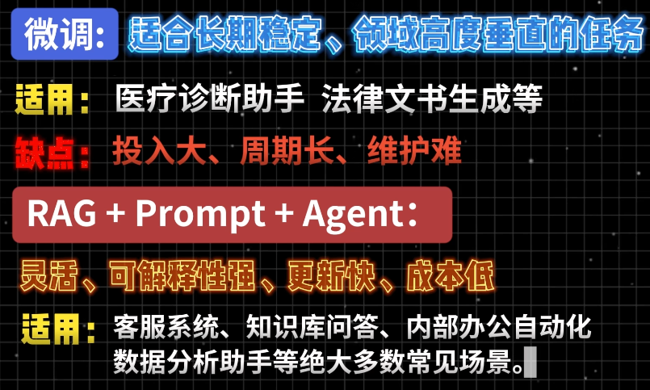
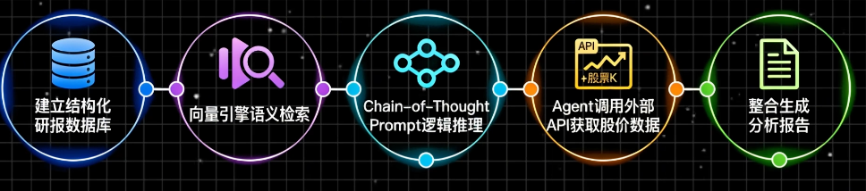

- AI大模型应用开发学习路线【码农小蟹】

 

---

# 【1】python

花3天学习python基础语法

 

---

# 【2】数学

主要看下神经网络，transformer 

 

---

# 【3】AI应用技术

1）卷积网络，循环网络；

## 【3.1】重点技术

RAG（检索增强生成） + 指令工程（prompt engieering）+Agent智能代理架构；

 

---

## 【3.2】微调（成本高，不建议一开始就学习）

微调成本非常高，一开始不要直接上手微调；

 

---

## 【3.3】学习思路

一开始不是掌握如何训练一个专属模型，而是如何让现有大模型更好的为业务服务。

而这背后的关键能力是什么？

### 【3.3.1】如何让大模型更好为业务服务

1. 如何让大模型更好为业务服务

- [ ] 如何构建高质量的知识库；
- [ ] 如何提升文档解析准确率；尤其是复杂pdf，扫描件，表格混合内容； 
- [ ] 如何设计分块策略，避免信息割裂？ 
- [ ] 如何优化向量化过程，提升检索召回率； 
- [ ] 如何结合多跳检索，重排序，查询扩展来提高答案准确性；
- [ ] 如何通过prompt工程引导模型输出结构化结果； 
- [ ] 如何搭建一个具备规划，工具调用，记忆能力的agent系统？

 

---

# 【4】案例

1）需求：一家金融公司想要做一个投研报告自助生成系统；

2）实现思路（基于rag+agent）：

- [ ] 建议结构化研报数据库；
- [ ] 向量引擎语义检索；
- [ ] Chain-of-thought-prompt 逻辑推理；
- [ ] agent调用外部api获取股价数据；
- [ ] 整合生成分析报告；

 

---

## 【4.1】rag重点知识

不能embedding模型的选择与评估；

检索性能与精度的平衡；

敏感信息过滤与权限控制； 

多源异步数据的融合处理；

agent的记忆机制与任务分解能力；

